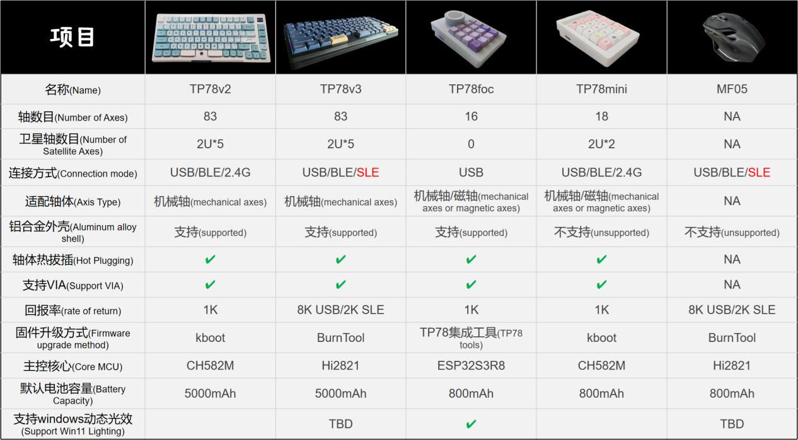
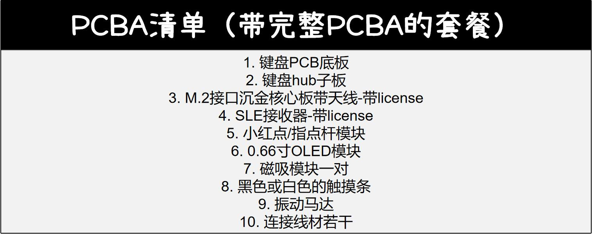
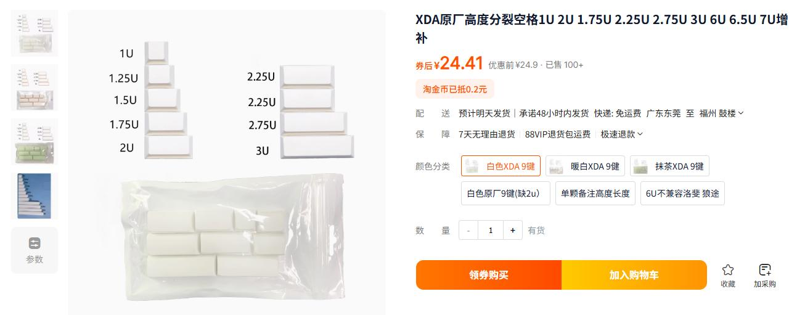
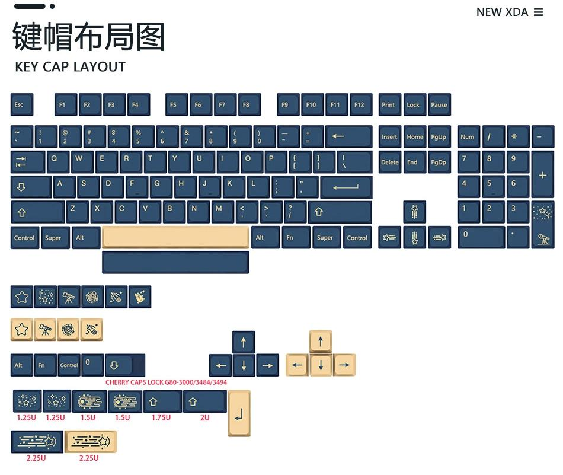
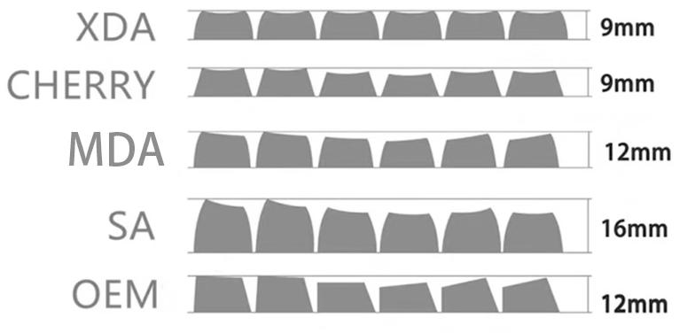
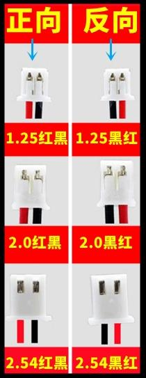
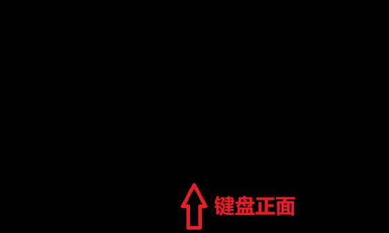

# TP78 主键盘复刻文档

- **文档版本**：1.0.1

## 前言

TP78v2 是基于 CH582M 的三模机械键盘方案

TP78v3 是基于海思的 SoC Hi2821/Hi2821E(TP78v3e) 的三模机械键盘方案

**键盘特性**：

1. **小红点控制**：实现鼠标移动，通过 Capslock 切层 + 左右空格实现鼠标左右键，或者双击触摸条左右侧实现鼠标键（该功能需要配置启用）
2. **触摸条控制**：实现触摸条左右滑动映射任意快捷键，快捷键可以通过 via 修改，默认左右滑动功能为多桌面切换
3. **OLED 显示**：OLED 功能显示，部分参数下位机可调节
4. **磁吸扩展支持**：支持 TP78foc 和 TP78mini 作为键盘扩展模块，详见教程中的扩展模块介绍视频

**芯片特性**：

- **TP78v2** - USB2.0 全速（1K 回报率）、BLE5.0、2.4G 私有协议连接
- **TP78v3** - USB2.0 高速（8K 回报率）、BLE5.4、星闪 SLE1.0 连接，硬件按键扫描功能

**TP78 硬件适配**：TP78v3 和 TP78v2 只相差核心板和接收器，主板完全适配

**TP78v3 新功能**：支持下位机宏录制，与 TP78v3 配套星闪鼠标、SLE 接收器支持键鼠宏控制，TP78v3 核心固件可以通过配列修改工具导出，并启用/关闭键盘相关功能

**固件版本说明**：

- CH582M 主控版本号范围 - 2.x.x 对应 TP78v2
- Hi2821 主控版本号范围 - 3.0.x 对应 TP78v3
- Hi2821e 主控版本号范围 - 3.y.x 对应 TP78v3e（y 不为 0）

## 目录

1. [材料的准备](#材料的准备)
2. [安装步骤](#安装步骤)
3. [教程视频](#教程视频)

## 1. 材料的准备

### 1) PCB 套件（以 TP78v3 为例）

PCB 底板、hub 子板、触摸条 PCB 开源文件参考：[TP78-基于 CH582M 的小红点 VIA 三模客制化键盘- 立创开源硬件平台](https://oshwhub.com/)

- 磁吸连接器引脚间距为 2.5mm
- OLED 模块必须是 0.66 寸 4 线 I2C 版本
- 小红点模块购买方式请加群了解

带 license 部分板子需要购买官方核心板/接收器/模组，也可以通过硬件开源自制，使用 demo 版本体验（demo 版本是 BS21 固件，无法使用 TP78v3e 的特有功能，并且其他部分功能限制，目前只支持单模星闪，不支持 low latency 模式和改配列功能）

也可以直接官方拼车购买 PCBA 清单，tb 店铺搜索：**皮皮工仿**

### 2) 外壳和定位板

外壳有 3D 打印和 CNC 铝合金 2 种，模型放在 makerworld 上：
<https://makerworld.com/zh/models/172159>

- **3D 打印**：3D 打印机的推荐尺寸：X 或 Y 轴单边长度需要大等于 350mm，否则无法打印整个键盘。对于没有大尺寸 3D 打印机也可以使用左右分体打印。
- **CNC 铝合金**：开车加群等通知，TP78 外壳上下盖/TP78foc 外壳上下盖+旋钮上盖/TP78 定位板/TP78foc 定位板，上下盖均包含阳极氧化工艺，可选阳极颜色。

定位板也可以通过 3D 打印或者切割制作，群内附定位板。

### 3) 五金件清单

| 元件名称 | 规格 | 数量 |
|----------|------|------|
| M2×3 螺丝 | M2×3 | 6 |
| M2 螺母 | M2 | 2 |
| M2×5 螺丝 | M2×5 | 2 |
| M2×11 螺丝 | M2×11 | 8 |
| M2×2×3 滚花螺母（CNC 无需购买） | M2×2×3 | 12 |
| M2×18 销柱（分体拼接用） | M2×18 | 3 |
| NGFF M.2 铜柱-1.5H M3 | 1.5H M3 | 1 |
| M3×4 螺丝（M.2 固定用） | M3×4 | 1 |

### 4) 其他散件

| 名称 | 数量 | 参考购买地址 |
|------|------|--------------|
| Gasket 定位板使用的硅胶粒 | 12 | <https://item.taobao.com/item.htm?id=744647593898> |
| 圆形脚垫 8mm*1mm | 4 | <https://item.taobao.com/item.htm?id=771706659250> |

### 5) 轴体

- **卫星轴**：5 个 2U，参考购买链接：<https://item.taobao.com/item.htm?id=708094660304>
- **机械轴体**：83 个（尽量买 85 个以上以防个别轴体损坏）。支持市面上所有线性机械轴和段落机械轴（不管 3 脚轴体和 5 脚轴体都支持）。国产轴体推荐：凯华 box 白、G 银 Pro、G 黄 Pro、灰木轴；进口轴体：CHERRY 银轴、红轴、茶轴。

### 6) 键帽

TP78 主键盘采用常规的 84 配列，但是分裂空格部分需要额外 2 个 2.25U 大小的键帽。一般由 2 种方式进行搭配：

- 第一种为额外购买增补键帽，例如：

- 第二种是购买的键帽本身配有额外的 2 个 2.25U 大小的键帽，如下图所示：

该键帽布局有额外的 2 个 2.25U，因此可以无需额外购买增补键帽。

**键帽高度的选择**：推荐 XDA 高度，XDA 高度每层的键帽尺寸一样，方便空格键帽安装，否则可能会出现空格键高于同行的其他按键的情况。

### 7) 电池

PCBA 套餐不带电池，因此电池需要额外购买。建议选购 5000mAh 以上的锂电池以保证电池有充足的续航。电池的推荐尺寸为长 100mm、宽 60mm、高 6mm（可以 tb 直接搜索 6060100 锂电池）。电池接线选择：2.0 红黑（PH2.0），自己选择电池后通电前请务必确认正负极性是否正确。

## 2. 安装步骤

### 底座部分安装

1. 磁吸扩展模块的安装（3D 打印外壳需要拆除支撑，并使用锉刀打磨，否则可能出现磁吸模块塞不进去的情况）

    

    **PS**：

    磁吸连接器的引脚确定：如自行购买，需确定最终安装的磁吸连接器线序否则无法和扩展模块对应。磁吸连接器对外线序如下图所示，可以测量 5V 和 GND 位置判断线序是否正确。其中键盘左侧安装磁吸连接器公头、右侧安装磁吸连接器母头。

2. Hub 子板安装

3. 电池安装（根据电池尺寸，电池与 Hub 子板可能会有重叠，电池需要用双面胶固定牢靠防止晃动）

4. 贴脚垫

### 顶盖部分安装

1. 小红点模块的安装（小红点需要先安装延长杆，之后套上小红帽，固定在顶盖）
2. 触摸条的安装（默认尺寸刚好不需要上胶，如果太松可以在背面贴一点薄的透明胶）

### PCB 安装

1. M.2 核心板安装
2. 安装定位板和轴体
3. 套上定位板的硅胶粒
4. 振动马达插线
5. OLED 安装

### 组合

1. Hub 排线连接
2. 小红点排线连接
3. 触摸条排线连接
4. 磁吸扩展模块排线连接
5. 锁紧上下盖螺丝

## 3. 教程视频

| 序号 | 内容 | 链接 |
|------|------|------|
| 1 | TP78v2 介绍 | <https://www.bilibili.com/video/BV1Ho4y1b78t> |
| 2 | TP78v3 介绍 | <https://www.bilibili.com/video/BV17P7DzeEUf> |
| 3 | TP78 扩展模块介绍 | <https://www.bilibili.com/video/BV1jVpneNEpq> |
| 4 | TP78 组装视频 | <https://www.bilibili.com/video/BV16m411R7Hc> |
| 5 | TP78mini 组装 | <https://www.bilibili.com/video/BV1bC4geBEWH> |