# TP78foc指导文档

- **文档版本**：1.1.4
- **TP78v3 固件版本**：1.1.4

## 前言

TP78_FOC是一个FOC控制无刷电机旋钮小键盘扩展模块。

支持作为TP78从模块使用，与TP78同步灯效、睡眠唤醒。

支持VIA改键、USB模式下神光同步、音量控制、surface dial控制、番茄钟以及自由键鼠组合键映射功能等。

硬件兼容磁轴、机械轴两种轴体。

固件升级方面支持USB在线升级。

默认配列如下：

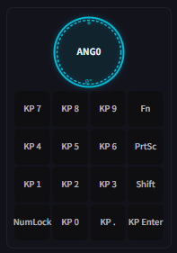

白色外观：

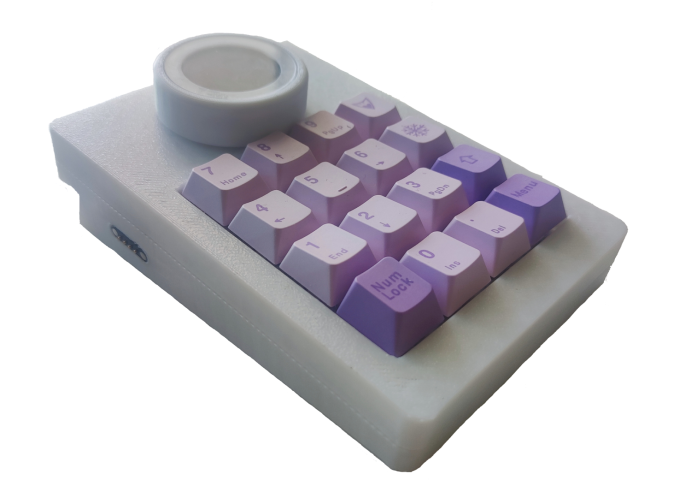

## 修订记录

| 日期         | 内容                  |
| ---------- | ------------------- |
| 2024/9/9   | 初始版本，适配固件版本V1.0.1   |
| 2024/11/10 | 适配固件版本V1.0.2        |
| 2024/11/25 | 适配固件版本V1.0.3        |
| 2025/3/30  | 适配固件版本V1.0.4        |
| 2025/8/16  | 适配固件版本V1.1.0        |
| 2025/8/26  | 适配固件版本V1.1.1        |
| 2026/1/11  | 适配固件版本V1.1.2        |
| 2026/1/15  | 适配固件版本V1.1.3        |
| 2026/7/4   | 适配固件版本V1.1.4，更新文档格式 |

## 固件更新说明

### V1.0.1

- 首发版本

### V1.0.2

- 更新压力校准显示压力数值
- 更新未校准压力或恢复出产设置后，不会因为默认值不准确导致错误的按下旋钮

### V1.0.3

- 更新压力校准算法和按压检测算法（部分硬件在4个区域按下的压力数值有所不同，因此软件做了适配）

### V1.0.4

- 修复USB连接下音量控制会频繁使音乐播放开始/停止的BUG

### V1.1.0

- 修改surface dial模式下旋钮操作状态不合理的问题
- 修复部分硬件开机按下和弹起作用相反的问题
- 增加设置选项，用户可以选择调整"力反馈"参数，并且应用到子菜单中

### V1.1.1

- 修复部分BUG：屏幕校准图案消失、5次Fn重置导致上电无限重启等

### V1.1.2

- 增加重置键盘报错显示错误码
- 增加Test菜单下格式化数据功能

### V1.1.3

- 增加自动组合键功能
- 增加Fn切层按键，增加VIA中TO切层和MO切层功能
- 修复VIA改键后保存失败的问题

### V1.1.4

- 支持modtrack增强式VIA改键工具
- 增加via的灯效控制
- 支持旋钮角度获取
- 支持新via网页debug信息输出功能

## Fn 键功能一览

| 功能      | 按键组合         | 说明                                                                                  |
| ------- | ------------ | ----------------------------------------------------------------------------------- |
| 重置所有配置  | `Fn` × 5     | LCD显示Reset OK前请勿掉电。若重置键盘提示失败，在不重启的情况下进入Test菜单，按住5直到屏幕提示"Fmt OK"后抬起按键，之后再按5次Fn重置键盘配置 |
| 进入/退出菜单 | `Fn + Enter` | 进入或退出菜单                                                                             |
| 切换层     | `Fn + 1~4`   | 分别切换到Layer0/1/2/3                                                                   |

## 升级固件的方法

### 使用乐鑫官方ESP32工具升级

使用乐鑫官方的ESP32工具升级（不推荐新手使用），工具名称：flash_download_tool_3.9.7.exe（版本号可新可旧）以及esptool.exe。

使用步骤：

1. 连接USB TypeC接口，电脑上进入工具目录中
2. 打开命令提示窗，输入：`.\esptool.exe run`，出现以下提示即可

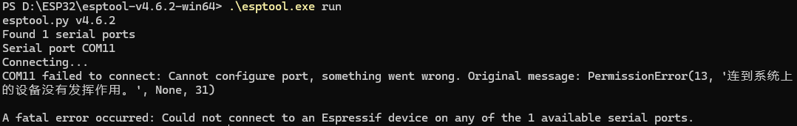

3. 双击打开flash_download_tool_3.9.7.exe
4. 按图中选项配置

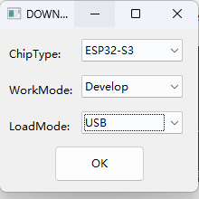

5. 点击OK后按图中的选项加载4个分区的bin文件

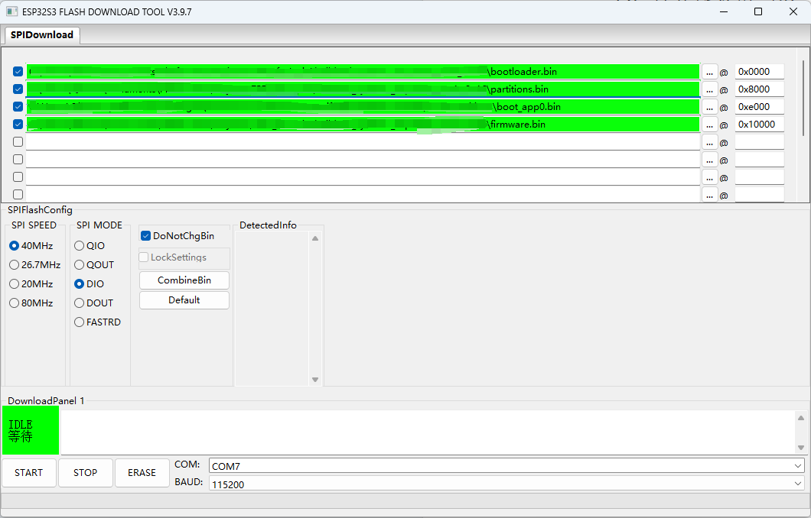

6. 注意选择对应的COM口，进入bootloader后，会新增一个COM口
7. 点击START直至下载完成后重启

### 使用TP78集成工具升级

TP78集成工具是TP78系列键盘通用上位机工具，相比ESP32工具升级更简单，升级过程中出现掉电也不会损坏当前固件，更加安全。

工具下载地址：
<https://github.com/ChnMasterOG/TP78-Integrated-Tools/releases/download/V1.0.0/TP78.Integrated.Tools.zip>

连接USB TypeC接口，电脑上打开工具，选择TP78foc固件升级工具：

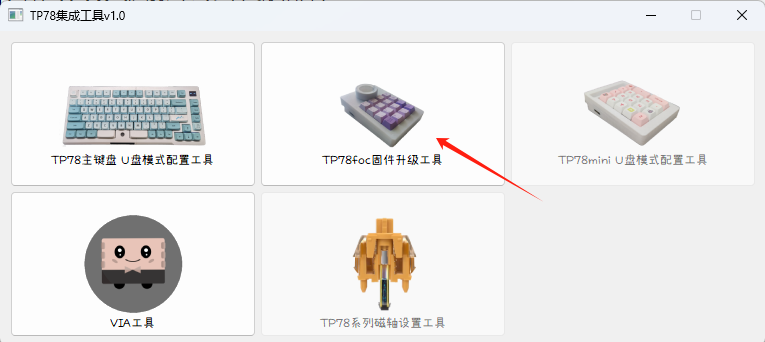

点击选择固件后点击更新固件即可，注意：这里的固件只要选择固件的主分区——firmware.bin：

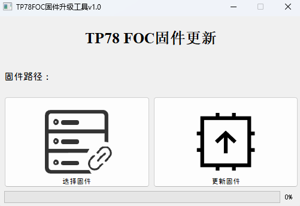

### 使用Modtrack增加via网页升级

TP78_foc支持通过网页更新固件：<https://via.modtrack.top>

连接USB TypeC接口，并在网页上连接键盘。点击固件更新，如图所示


点击选择固件后点击“开始固件升级”-"开始升级"并等待固件更新完成，注意：这里的固件只要选择固件的主分区——firmware.bin：

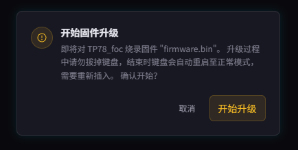

## 菜单介绍

### 轴体识别

轴体识别功能会在上电自动识别硬件所连接的轴体，目前固件只支持机械轴体，但识别功能依然会存在。


当开机右上角出现图标的时候表示当前处于磁轴工作模式，否则为机械轴。

升级固件结束后复位可能会出现轴体识别不准确的情况，此时只需要重新开关电源即可恢复。

### Surface dial

该功能需要windows支持旋钮外设，以win11为例：


在设置中选择"蓝牙和其他设备-滚轮"

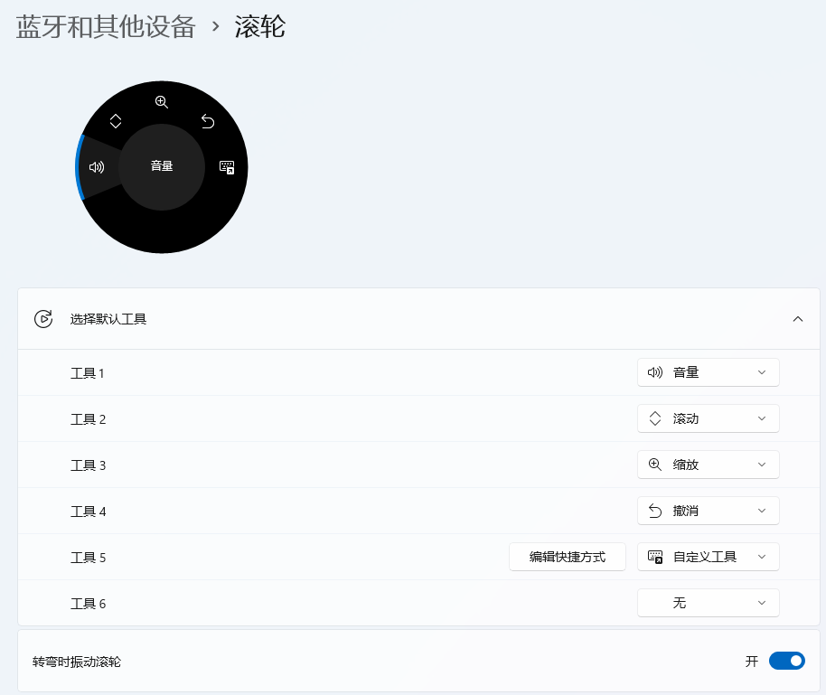

可以设置不同工具

若软件支持使用旋钮功能，也可以进行设置

弹出滚轮操作框的方法：长按住旋钮

更多功能可以在微软官网查看，文档中不再赘述

### 音量调节

目前只支持音量调节，后续可能会增加其他多媒体控制

### 番茄钟

该功能旨在做一个久坐提醒，倒计时结束后会发起振动

### 屏幕校准（参数会保存，除非被清除）


屏幕安装并非旋钮正中间，因此需要做屏幕校准，将显示位置调整到旋钮中间。按下1表示调整X轴（最低偏移不能为负数），2表示调整Y轴（最低偏移不能为负数），3表示调整宽度缩放（例如需要向左移动，但X轴基准已经到0，此时可以缩小宽度，使得屏幕处于正中间），4表示调整高度缩放（例如需要向上移动，但Y轴基准已经到0，此时可以缩小高度，使得屏幕处于正中间）。

校准后，需要重启生效。

### 压力校准（参数会保存，除非被清除）


若一开始没有压力参数，压力校准是第一步需要校准的步骤。该模式通过检测按压4个区域和弹起的压力传感器数值进行校准压力。进入压力校准模式的前3秒不要按压旋钮，进入压力校准模式后分别按下旋钮的4个区域（稍微用点力），可以观察到屏幕的压力数值明显改变，最后按Fn+回车退出该模式。校准后，需要重启生效。若一开始旋钮没有压力参数，需要通过Fn+回车进入该模式。若按Fn+回车无法进入该模式，请先重置所有配置。

V1.0.2版本后，压力校准会显示当前压力传感器采集的数值。

### 组合键

组合键1/2/3允许非上位机或软件特殊适配而支持模拟任意按键宏+鼠标操作。TP78foc最多支持20个按键宏。根据VIA中的globalsettings，设定组合键映射按键宏的下标0, 2, 4, 6, ..., 18。例如设定的是0，则左旋代表按下M0按键，右旋按下M1按键；设定的是2，则左旋代表按下M2按键，右旋代表按下M3按键，以此类推。

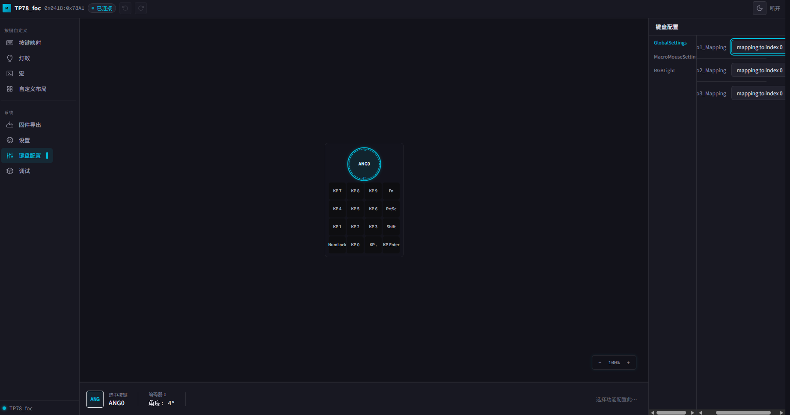

MacroMouseSettings表示每个按键宏对应的鼠标操作（下标从1开始），正常是20个，但layerout未更新，图中只显示6个。例如：图中当前配置为M0操作（左旋）为鼠标向上滚动，M1操作（右旋）为鼠标向下滚动。

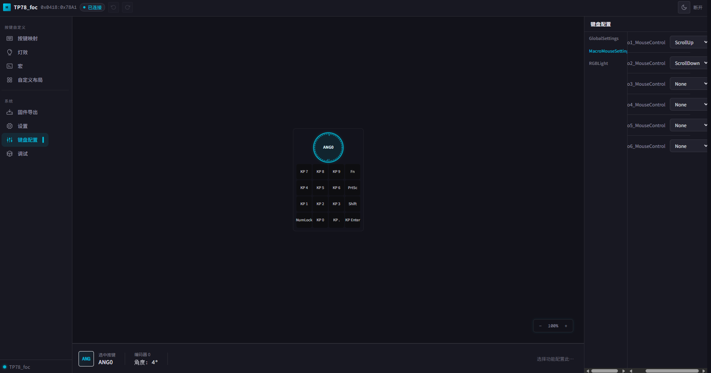

### 自动组合键

自动组合键是组合键的升级版。进入自动组合键菜单会显示当前层序号。当前层如果在1/2/3则旋钮功能会自动变成对应的组合键功能（层1对应组合键1、层2对应组合键2、层3对应组合键3，层4则不使用组合键）。

modtrack VIA切层功能：

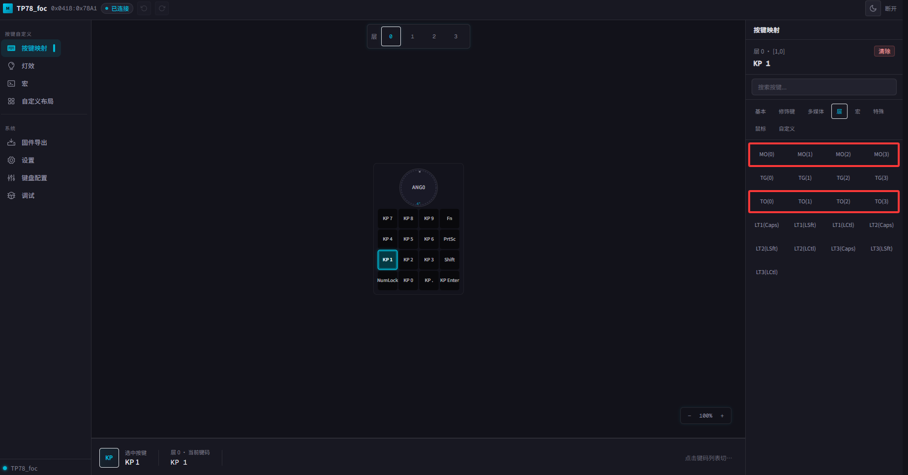

- **TO(n) 切层**：按下后切到第n层
- **MO(n) 切层**：按下后切到第n层，抬起回到原来的层

### 测试模式

该模式仅出产测试使用，普通用户无需关注。

### 设置模式

- **KnobParamCfg** - 选择修改"力反馈"的参数，选择后输入参数后按下旋钮保存。（参数修改界面：Numlock为负号、Enter为退格、Pad数字键和小数点键可用）
- **TestParamCfg** - 测试修改的"力反馈"参数，测试KnobParamCfg的力反馈参数。测试模式下通过按下旋钮返回上级菜单
- **ApplyParamCfg** - 应用修改的"力反馈"参数，将"力反馈"参数应用到任意的子菜单中，例如：Surface dial、音量调节、番茄钟等。按下后等待几秒钟显示Apply OK即保存成功，按下旋钮可以返回

## "力反馈"参数介绍

本项目的旋钮参数参考于：<https://github.com/scottbez1/smartknob>

相关参数见结构体：PB_SmartKnobConfig

结构体见文件描述：firmware/src/proto_gen/smartknob.pb.h

### position

```c
设置整数位置。
注意：为了使SmartKnobConfig具有幂等性，仅当当前位置与之前的配置相比发生变化时（而非与当前状态相比！），才会将当前位置设置为该值。因此，默认情况下，如果您发送的配置位置为5，而当前位置为3，如果之前已经处理过配置更改为5的情况，则位置可能仍为3。如果您需要强制更新位置，请参阅position_nonce。
```

### sub_position_unit

```c
设置分数位置。
典型范围：(-捕捉点，捕捉点)。
实际范围在技术上是无界的，但在实践中，该值将在下一个控制循环中与snap_point进行比较，因此，任何超出snap_point的值通常都会导致整数位置的变化（除非位置已经达到极限）。
注意：`position`文档中提到的幂等性含义在此处同样适用。
```

### position_nonce

```c
位置通常只在发生变化时才需要应用，但有时需要将位置重置为相同的值，因此可以使用随机数变化来强制应用位置值。
注意：该值必须小于256。
```

### min_position

```c
最小位置限制
```

### max_position

```c
最大位置限制
```

### position_width_radians

```c
每个位置/定位点的角度"宽度"，以弧度为单位。
```

### detent_strength_unit

```c
施加制动力的强度。典型范围：[0, 1]。
值为0时禁用位置锁定。
不建议使用大于1的值，因为这可能会导致行为不稳定。
```

### endstop_strength_unit

```c
在最小/最大边界处施加的限位扭矩强度。典型范围：[0, 1]。
值为0时，会禁用限位扭矩，但并不会使位置无界，即旋钮不会尝试返回到有效区域。对于无界旋转，请使用min_position和max_position。
不建议使用大于1的值，因为这可能会导致行为不稳定。
```

### snap_point

```c
位置将增减的分位（子位置）阈值。典型范围：（0.5，1.5）。
这定义了如何将滞后特性应用于位置，这就是为什么会有这些值。
```

### detent_pos_count

```c
对于"磁性"止动模式（并非所有位置都应有止动器），此选项指定了哪些位置（最多5个）启用了止动器。旋钮会感觉像被"磁性"吸引到这些位置，并且会平滑地旋转经过所有其他位置。这种方法能够在保持Config尺寸有界的同时，有效地实现无界止动位置，并且能够适应快速旋转且紧密排列的止动器，因为可以提前发送多个止动位置；无需在每个止动器之间进行完整的往返Config-State交互以保持同步。
```

### detent_pos_0~detent_pos_4

```c
止动模式的位置0~4。例如：当detent_pos_count=3，则detent_pos_0~detent_pos_2生效
```

### snap_point_bias

```c
一项高级功能，用于将定义的捕捉点从中心（位置0）移开，以实现不对称定位。典型值：0（对称定位力）
这可用于创建锁定的位置，当小心释放时，定位槽能保持位置不变，但也能轻易被扰动而返回"原位"，即位置0。
```

### 应用示例

**无限制可任意旋转**

```c
.position = 0,
.sub_position_unit = 0,
.position_nonce = 0,
.min_position = 0,
.max_position = -1,
.position_width_radians = 10 * 3.1415926 / 180,
.detent_strength_unit = 0,
.endstop_strength_unit = 1,
.snap_point = 1.1,
.detent_positions_count = 0,
.detent_pos_0 = 0,
.detent_pos_1 = 0,
.detent_pos_2 = 0,
.detent_pos_3 = 0,
.detent_pos_4 = 0,
.snap_point_bias = 0,
```

**齿轮感（默认番茄钟的效果）**

```c
.position = 127,
.sub_position_unit = 0,
.position_nonce = 5,
.min_position = 0,
.max_position = -1,
.position_width_radians = 1 * 3.1415926 / 180,
.detent_strength_unit = 1,
.endstop_strength_unit = 1,
.snap_point = 1.1,
.detent_positions_count = 0,
.detent_pos_0 = 0,
.detent_pos_1 = 0,
.detent_pos_2 = 0,
.detent_pos_3 = 0,
.detent_pos_4 = 0,
.snap_point_bias = 0,
```

**限位回弹（默认菜单选择的效果）**

```c
.position = 0,
.sub_position_unit = 0,
.position_nonce = 11,
.min_position = -1,
.max_position = 1,
.position_width_radians = 10 * 3.1415926 / 180,
.detent_strength_unit = 0,
.endstop_strength_unit = 1,
.snap_point = 1.1,
.detent_positions_count = 0,
.detent_pos_0 = 0,
.detent_pos_1 = 0,
.detent_pos_2 = 0,
.detent_pos_3 = 0,
.detent_pos_4 = 0,
.snap_point_bias = 0,
```

> **注意**：以上参数如果看不懂，可以修改后结合实际效果调试！

## 改键和配置键盘工具介绍

TP78foc支持 **VIA网页改键** 或者使用 **modtrack增强式via改键（推荐）**

打开改键网址：<https://via.modtrack.top/>

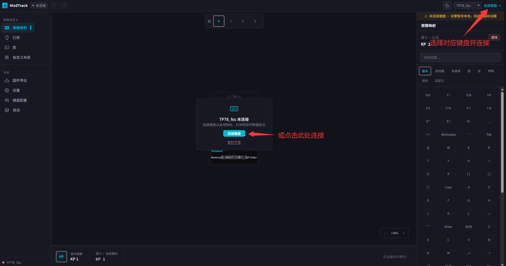

点击"连接键盘"后就进入改键页面，可以直接选中右边按键进行修改。

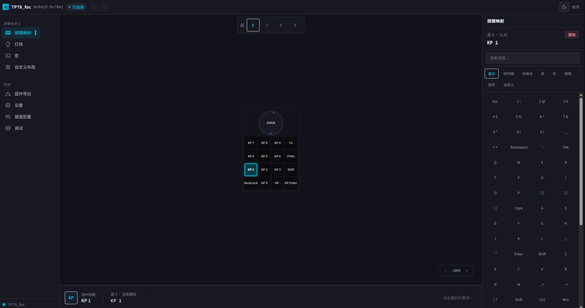

点击旋钮后，可以查看旋钮的实时角度信息。

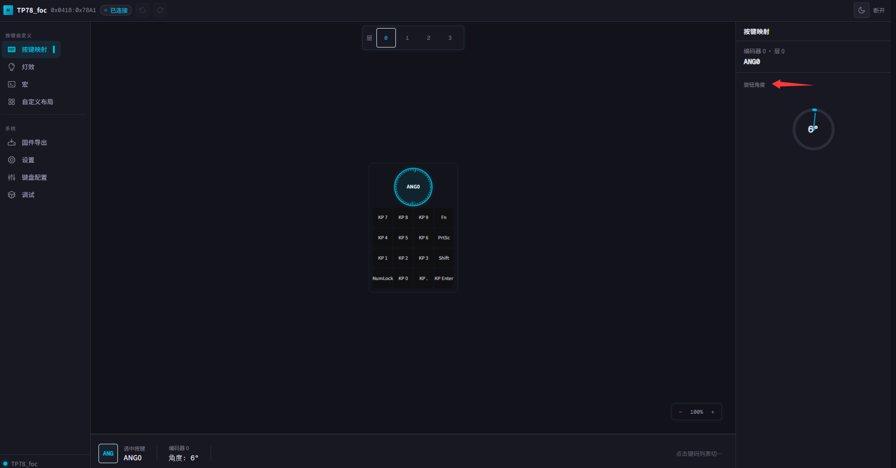

### 按键宏的设置

点击MACRO，M0~M19为宏按键，可以实现1个按键触发不同组合键。宏按键设置方法与普通按键一致。

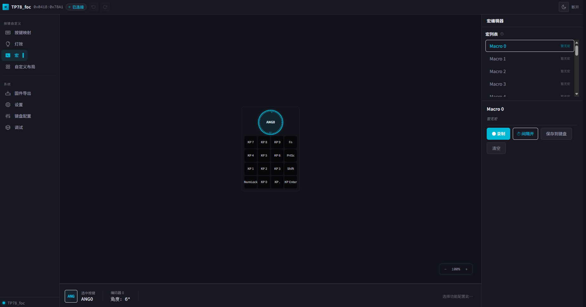

点击图标可以录入宏按键，TP78foc支持单个宏按键实现6个按键同时按下的组合，与TP78不同，TP78foc支持"间隔开"的模式(按下各个按键之间间隔时间可调整)。

### 键盘配置修改

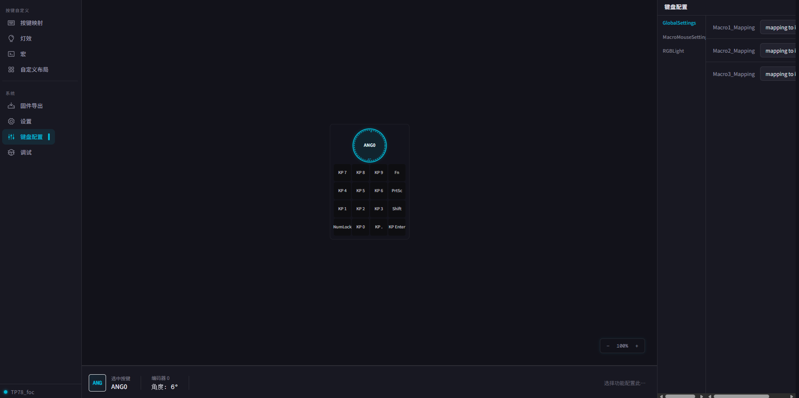

点击图标可以修改TP78foc配置，更多配置会在今后慢慢完善中。

## 教程视频

| 内容                       | 链接                                           |
| ------------------------ | -------------------------------------------- |
| 【开源】历时3年，打造一个模块化力反馈旋钮小键盘 | https://www.bilibili.com/video/BV1jVpneNEpq/ |

## 其他说明

其他未尽事宜，以官方发布信息为准。

若有其他问题，请在技术交流QQ群：678606780中提问。
