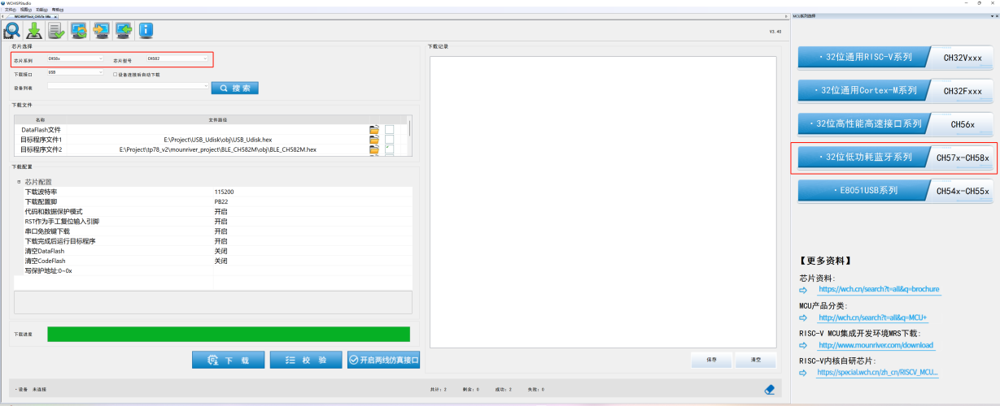
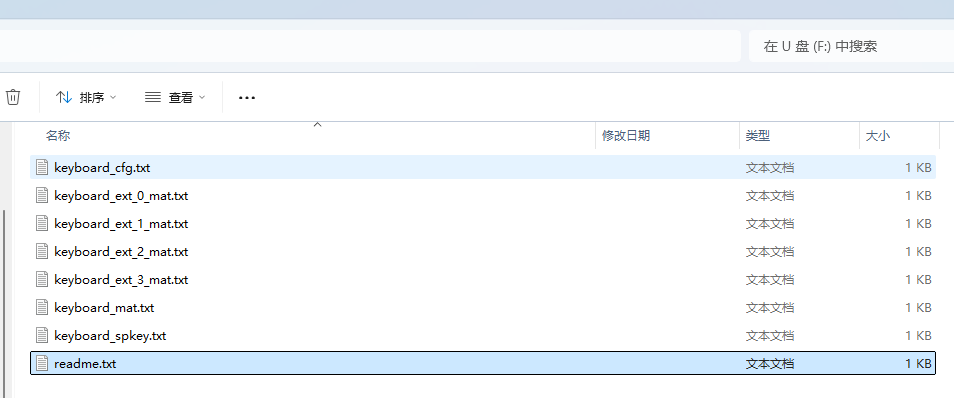
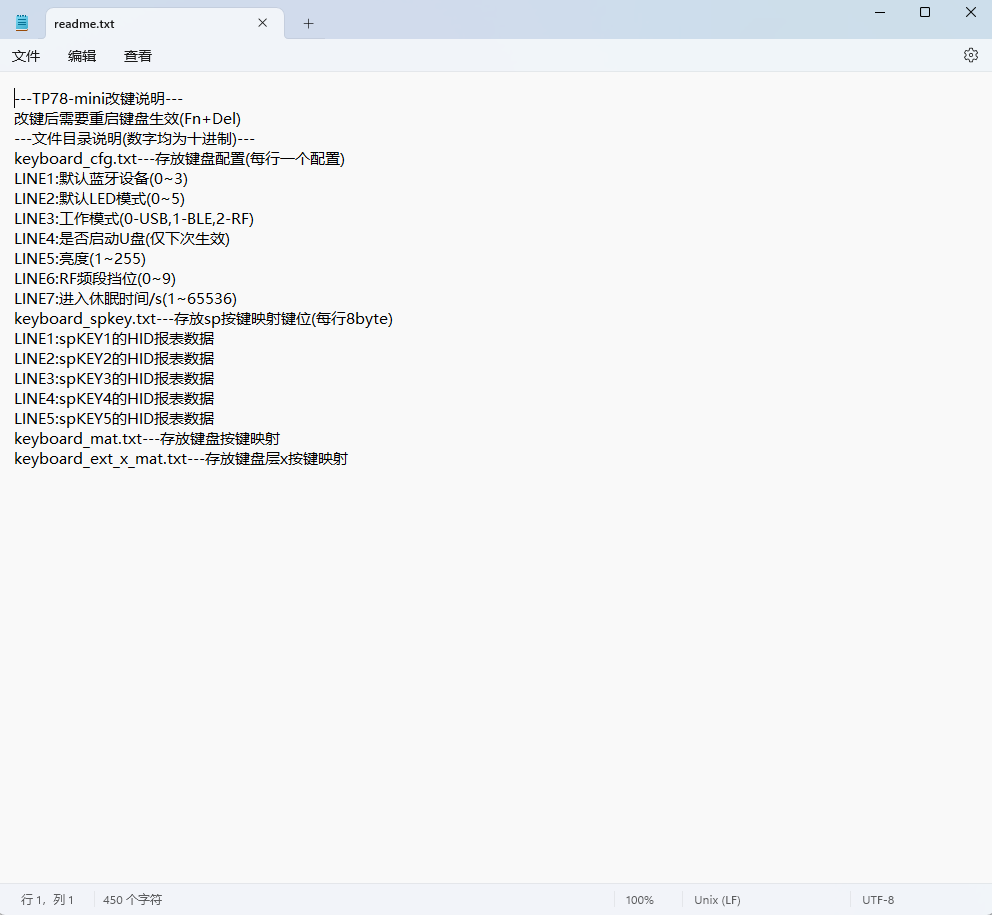
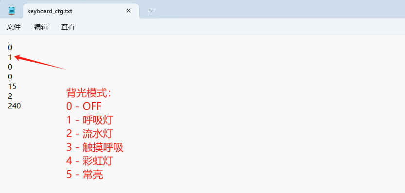

# TP78mini 指导文档

- **文档版本**：1.0.0
- **TP78mini 固件版本**：1.0.0

## 前言

TP78mini 是基于 WCH CH582(F) 的三模（USB / 蓝牙 / RF 2.4G）小键盘方案。

**芯片特性**：USB2.0 全速（1000Hz 回报率）、BLE5.4、RF 2.4G 连接，硬件按键扫描功能。

**主控方案**：WCH CH582 / CH582F，集成 BLE 与 USB。

**新功能**：支持按键宏（Macro），最多 6 键组合宏。

**改键方式**：通过 VIA 网页改键工具或者 U 盘模式直接修改按键与配置文件。

**固件版本说明**：当前最新版本为 V1.0.0。

## 修订记录

| 日期 | 内容 |
|------|------|
| 2024/9/10 | 适配固件版本 V1.0.0 |
| 2026/7/7 | 更新指导文档，适配modtrack via新网页 |

## 固件更新说明

### V1.0.0

1. 首次发行

## Fn 键功能一览

| 功能 | 按键组合 | 说明 |
|------|----------|------|
| 重置键盘配置 | `Fn × 5` | 按完后等待一段时间不要掉电 |
| USB 模式 | `Fn + 7` | 切换为 USB 有线模式 |
| 蓝牙模式 | `Fn + 8` | 切换为蓝牙无线模式 |
| RF 模式 | `Fn + 9` | 切换为 RF 2.4G 无线模式 |
| 接收器进入 BootLoader 模式 | 不支持 | - |
| 主键盘进入 BootLoader 模式 | `Fn + Numlock` | 让主键盘进入 kboot 模式（仅板子带 kboot 固件才能生效） |
| 切换层级 | `Fn + 1 / Fn + 2 / Fn + 3 / Fn + 4 / Fn + 5` | 切换键盘到不同层（目前最多支持 5 层），不同层可以有不同的按键定义，可以通过 VIA 进行修改 |
| 减小音量 | `Fn + -` | 减小音量 |
| 增大音量 | `Fn + +` | 增大音量 |
| 进入 U 盘模式 | `Fn + 0` | USB 模式下按 `Fn + 0` 复位键盘并进入 U 盘模式（注意：U 盘模式下 VIA 改键无法使用，并且进入 U 盘模式后下次重启键盘默认失效） |
| 蓝牙多设备切换 | `Fn + 0` | 在蓝牙模式下按 `Fn + 0` 会切换到下一个蓝牙设备（最多支持 4 个蓝牙设备）；该操作会自动复位键盘并切换到对应设备 |
| 蓝牙清除绑定信息 | `Fn + 8` | 如果某个设备号在键盘上被绑定过，则该设备号下不能连接其它设备，需要清除绑定信息。目前只支持一键清除所有绑定信息，在蓝牙模式下按 `Fn + 8` 清除所有绑定信息 |
| 背光模式切换 | `Fn + /` | 按下 `Fn + 除号` 切换下一种背光模式，背光模式顺序：关闭(off) / 呼吸灯(breath) / 流水灯(waterful) / 触控呼吸(touch) / 彩虹灯(rainbow) / 固定亮度(normal)，下电后不保存 |
| 复位键盘 | `Fn + Del` | 复位键盘 |

## 升级固件的方法

### 使用 WCH ISP 工具升级（适用于首次烧录）

使用 WCH 官方的 ISP 工具进行固件升级（仅支持 Windows 操作系统，不推荐新手使用），工具名称：`WCHISPTool_Setup.exe`。

使用步骤：

1. 安装工具和相关驱动；
2. 打开软件，选择 MCU 系列："32 位低功耗蓝牙系列"，芯片选择：CH58x，芯片型号：CH582；

    

3. 拆除外壳短接主板背面 boot 按键上电进入 ROM boot 模式；
4. 在设备列表找到自己的设备，若找不到请重新拔插 USB 并尝试；
5. 根据需求勾选相关下载配置，一般不需要特殊设置，保持默认即可；
6. 选择目标程序文件 1，选择固件对应的 Hex 文件并勾选右侧选项框；
7. 点击下载按钮。

> **注意**：若为官方渠道购买的板子自带 kboot，不建议使用该方法进行升级，一旦操作不当会将 kboot 刷掉。若 kboot 刷掉则不接受无偿重刷固件！！！

### 使用 kboot 升级固件

Github 上不包含 kboot 代码，只有从官方渠道购买的板子默认会刷好 kboot 固件。没有 kboot 固件不影响键盘正常使用，有 kboot 固件的板子建议使用 kboot 升级固件，无需额外安装软件，升级更加方便和安全。

使用步骤：

1. 按下 `Fn + Numlock` 进入 kboot 模式 / 按住 Fn 键上电进入 kboot 模式；
2. 弹出 U 盘选择格式化，此时键盘中的主固件被擦除；
3. 将新固件（.bin）文件重命名成 `firmware.bin` 之后拖进 U 盘；
4. 重启后等待几秒自动更新完成。

> **注意**：若擦除固件未刷入新固件或者刷错固件，键盘会不能使用，此时不需要紧张，按住 Fn 上电刷入新的固件即可。

## 同步固件的最新改动

固件的升级经常伴随对配置的改动，例如新增一些配置，但是在升级固件时不会自动更新旧的配置。相对地，通过按下 5 次 Fn 会重置配置到当前固件支持的最新版本，但是会丢失原来一些偏好配置（例如：原先配置默认背光模式为常亮，重置后默认背光会恢复为呼吸灯）。此时只能通过 U 盘模式来把旧的配置文件导出，之后按下 5 次 Fn 重置后，按下 `Fn + 0` 重启键盘并再次进入 U 盘模式，再一行一行将配置文件进行核对。

## 改键工具介绍

TP78mini 支持 modtrack VIA 网页改键。

传统 VIA 改键网址：<https://usevia.app/>

modtrarck VIA 改键网址：<https://via.modtrack.top/>

## U 盘模式介绍

TP78mini 通过一块固定的 dataflash 记录按键编码和配置信息，并且该区域搭载一个 FAT 文件系统。进入 U 盘模式，可以直接对 U 盘中的 TP78mini 按键以及配置修改，U 盘模式可以修改 TP78mini 的所有可改配置，包括 VIA 模式下无法修改的部分。

按 `Fn + 0` 进入 U 盘模式，在该模式下 VIA 功能不能使用。查看 U 盘中的 TP78mini 配置文件。

U 盘模式中的配置修改可以直接参考 `readme.txt`。

例如：修改背光的默认模式可以直接打开 `keyboard_cfg.txt`，修改文件的第二行。

U 盘模式中同样可以修改按键编码，其中主键盘层的编码矩阵存放在 `keyboard_mat.txt`，额外键盘层的编码矩阵存放在 `keyboard_ext_X_mat.txt`（X 为层数，TP78mini 最多支持 4 层额外层按键）。通过 TP78 集成工具可以生成键盘矩阵的编码。

通过修改 `keyboard_spkey.txt` 来修改 TP78mini 的按键宏，其中每一行代表宏按键按下后产生的组合键标准键盘 HID 编码值。

| Index 0 | Index 1 | Index 2 | Index 3 | Index 4 | Index 5 | Index 6 | Index 7 |
|---------|---------|---------|---------|---------|---------|---------|---------|
| 功能键 | 保留 | Key0 | Key1 | Key2 | Key3 | Key4 | Key5 |

也可以通过 TP78 集成工具中的 TP78mini U 盘改键工具的 log 信息获取。例如：同时按下 1、2、3 的 HID 编码值为 `0 0 30 31 32 0 0`。

## 教程视频

| 内容 | 链接 |
|------|------|
| 【开源】历时 3 年，打造一个模块化力反馈旋钮小键盘 | <https://www.bilibili.com/video/BV1bC4geBEWH> |

## github 代码适配

github 上代码固件仅适配 tp78mini 官方发行版本，若需要基于此进行开发或者 DIY，需将 `Link.ld` 文件 FLASH 的起始地址修改为 0。

若存在其他问题，请在技术交流 QQ 群：678606780 中提问。