# TP78v2 指导文档

- **文档版本**：1.1.10
- **TP78v2 固件版本**：2.1.15

## 前言

TP78v2 是基于 WCH（南京沁恒）CH582 三模机械键盘方案。

**芯片特性**：USB 全速（低速模式）、BLE5.x、2.4G RF 私有协议连接。

**全功能支持**：小红点、触摸条控制，OLED 显示，磁吸扩展接口（TP78foc/TP78mini/Salieri），可换键帽 MX 轴体。

**新功能**：支持 VIA 改键，VIA 按键宏（不支持 delay），共 USB/BLE/RF 三模以及 USB+BLE 共存模式。

**配列修改功能**：通过 VIA 网页改键工具或 U 盘模式可以任意修改配列，启用/关闭键盘相关功能。

**固件版本说明**：从 V2.1.1 版本开始，2.4G RF 模式下需要同步更新最新接收器固件；从 V2.1.3 版本开始，同上要求。Github 上代码固件仅适配带 kboot 的 TP78 版本。

## 修订记录

| 日期 | 内容 |
|------|------|
| 2024/3/8 | 适配固件版本 V2.0.12 |
| 2024/3/16 | 适配固件版本 V2.0.13 |
| 2024/3/24 | 增加目录以及相关教程视频，修改点用红色 |
| 2024/3/24 | 增加固件版本更新说明 |
| 2024/6/14 | 适配固件版本 V2.1.1，从 2.0.x 版本升级到该版本固件需要同步更新最新接收器固件，否则无法正常使用 RF 模式 |
| 2024/6/18 | 适配固件版本 V2.1.2 |
| 2024/7/20 | 适配固件版本 V2.1.3，增加图文教程、图标示意。从 2.1.3 之前的版本升级到该版本固件需要同步更新最新接收器固件，否则无法正常使用 RF 模式 |
| 2024/9/1 | 适配固件版本 V2.1.5 |
| 2024/10/23 | 适配固件版本 V2.1.6 |
| 2024/11/6 | 适配固件版本 V2.1.7 |
| 2025/1/14 | 适配固件版本 V2.1.8 |
| 2025/2/22 | 适配固件版本 V2.1.9 |
| 2025/3/22 | 适配固件版本 V2.1.10 |
| 2025/8/23 | 适配固件版本 V2.1.11，增加自建 VIA 网址。 |
| 2025/11/8 | 适配固件版本 V2.1.12 |
| 2025/11/29 | 适配固件版本 V2.1.13 |
| 2026/4/8 | 适配固件版本 V2.1.14，增加指导文档中按键和切层说明 |
| 2026/7/11 | **【重要】** 适配固件版本 V2.1.15 并更新指导文档格式 |

## 固件更新说明

### V2.0.11
- 修复部分硬件 OLED 上电不亮的问题
- Relase 版本增加起始 0x0 地址的固件版本
- 修复多按键按下弹起任意一个按键导致所有按键被弹起的问题

### V2.0.12
- 增加游戏模式（降低键盘延迟，提升响应速度。相对地，游戏模式下关闭部分功能）
- 修改接收器进 BOOT 模式为 `Fn + ESC`，防止按错

### V2.0.13
- 优化低功耗模式，修改后灭屏蓝牙不会断连
- 增加进入屏保和低功耗时间可配置

### V2.0.14
- 修复 SP 键无法正常工作的 BUG
- 增加小红点读取数据期间禁用中断

### V2.0.15
- 修改按键弹起逻辑，避免出现重复键码
- 优化 USB HID 信息发送状态的判断

### V2.1.1
- 【代码逻辑优化和稳定性】优化按键按下时 HID 编码逻辑，更新 I2C 驱动
- 【SDK 更新】更新 WCH SDK 至 2024 年 1 月版本
- 【优化 2.4G 连接】更新版本后 RF 模式下 Numlock 状态会被显示在 OLED，当信号不好出现丢包后键盘会自动发起重传，默认发起重传时间为 10ms，可以通过 `RF_chk_ms` 参数修改时间，该功能需要同步升级接收器固件后才能生效
- 【扩展模块协议】适配 miniFOC 和 TP78mini 扩展模块
- 【低功耗相关】低功耗相关代码更新

### V2.1.2
- 支持 VIA 修改按键宏功能，但不支持延迟发送功能

### V2.1.3
- 取消触摸条左中右按键振动，修复小红点和触摸条联合使用会造成小红点无法移动的 BUG
- 优化扩展模块连接稳定性
- 修改 USB/BLE/RF 的连接描述符配置，新增旋钮配置。更新版本后需要同步升级接收器固件

### V2.1.5
- 修改触摸条按键/滑动触发振动的功能为可配置（配置项：`motor_en`）

### V2.1.6
- 增加 USB 和蓝牙共存模式，按 `Fn + F9` 切换至共存模式。在共存模式下，按 `Fn + PageUp` 切换到 USB 输入，按 `Fn + PageDown` 切换到蓝牙输入
- 修改 VIA 的 layout 布局文件，原先键盘布局为 15 列，实际只有 14 列，对应固件 VIA 相关内容进行修改。更新版本后 VIA 的布局文件需要同步最新（<https://via.modtrack.top> 会一直保持最新布局文件，旧版本固件要使用改网址需要更新固件否则按键会出现错位）

### V2.1.7
- 修复主机睡眠后键盘无法唤醒主机并连接上 USB 的 BUG

### V2.1.8
- 修复 V2.1.6 和 V2.1.7 版本无法使用 RF 功能的 BUG
- 增加 `Fn + Y` 单独控制触摸条滑动使能功能，`Fn + T` 只控制小红点使能功能
- 优化游戏模式下延迟

### V2.1.9
- 增加 VIA 磁轴指令
- 增加测试模式（`Fn + Z`），该模式仅供新功能测试使用

### V2.1.10
- 增加记录上次刷入的固件版本号功能

### V2.1.11
- 增加自动鼠标键功能，配置项：`auto_mouse`。打开自动鼠标键功能，移动小红点期间空格左右按键会自动变成第二层的按键（默认为鼠标左右键）
- 修复 CapsLock 切层后按下 Shift、Ctrl 等按键，先抬起 Capslock 导致第二层按键无法抬起的 BUG
- 修改蓝牙参数更新 latency，实测蓝牙模式下减小 1~2mW 功耗
- 修复使用 modtrack via 工具时会产生感叹号报错信息

### V2.1.12
- 修改自动鼠标键功能。打开自动鼠标键功能，移动小红点期间键盘会切换到第二层（原先只切换左右空格）
- 增加 `KEY_TP_MAP_SCROLL` 键（在"自定义" - TP Scroll 按键），按下后小红点 Y 方向移动变成 Z 方向移动，再次按下后取消
- 增加一级待机（idle）下 OLED 屏幕亮度降低的功能

### V2.1.13
- 增加系统切换功能，配置项：`mac_mode`。选择 0-windows 系统（兼容 linux），1-macOS。选择 1 使用 windows 系统无法在系统休眠时强制唤醒功能

### V2.1.14
- 增加适配扩展模块 Salieri

### V2.1.15
- 增加debug log功能
- 增加灯效同步功能
- 修改按键映射等

## Fn 键功能一览

| 功能 | 按键组合 | 说明 |
|------|----------|------|
| 重置键盘配置 | `Fn` × 5 | 直至 OLED 提示 Reset OK 前请勿掉电 |
| 交换按键 | `Fn + C` + 两个键 | 先按下 `Fn + C`，再按下 `Fn + 第一个键` 和 `Fn + 第二个键`，实现两键交换。交换按键后掉电依然保存 |
| OLED 参数配置 | `Fn + O` | 进入 OLED 参数配置界面。W/S 上下移动，A/D 选择退回/进入菜单，Enter 确定，Esc 返回 |
| USB 模式 | `Fn + F10` | 切换为 USB 有线模式 |
| 蓝牙模式 | `Fn + F11` | 切换为蓝牙无线模式 |
| RF 模式 | `Fn + F12` | 切换为 2.4G RF 无线模式 |
| USB/BLE 共存模式 | `Fn + F9` | 切换为 USB 蓝牙共存模式 |
| 共存模式选 USB | `Fn + PageUp` | 共存模式下选择发送 USB 数据 |
| 共存模式选 BLE | `Fn + PageDown` | 共存模式下选择发送蓝牙数据 |
| 接收器进 BootLoader | `Fn + ESC` | 让接收器进入 BootLoader 模式（注意：接收器刷错固件后只能拆卸返修） |
| 主键盘进 kboot | `Fn + B` | 主键盘进入 kboot 模式（仅板子带 kboot 固件才能生效） |
| 减小音量 | `Fn + -` | 减小音量 |
| 增大音量 | `Fn + +` | 增加音量 |
| 开关小红点 | `Fn + T` | 打开或关闭小红点，同时开关触摸条鼠标左右击功能（受 `Tbtn_en` 配置影响） |
| 开关触摸条滑动 | `Fn + Y` | 打开或关闭触摸条滑动功能 |
| 进入 U 盘模式 | `Fn + U` | 复位键盘并进入 USB+U 盘模式（U 盘模式下 VIA 改键无法使用） |
| 进入游戏模式 | `Fn + G` | 进入/退出游戏模式，提升响应速度，同时屏蔽指点杆、触摸条、OLED 和低功耗 |
| 蓝牙多设备切换 | `Fn + 1~4` | 切换蓝牙设备，下电后保存 |
| 清除蓝牙绑定 | `Fn + 0` | 清除所有绑定信息 |
| 背光模式切换 | `Fn + F1~F6` | 关闭(off)/呼吸灯(breath)/流水灯(waterful)/触控呼吸(touch)/彩虹灯(rainbow)/固定亮度(normal) |
| 复位键盘 | `Fn + R` | 复位键盘 |
| 版本显示 | `Fn + Del` | 彩蛋模式，可以看到固件版本 |
| 测试模式 | `Fn + Z` | 仅开发人员使用 |

## 升级固件的方法

### 使用 WCH 官方 ISP 工具升级固件（接收器必须用此工具）

> 该工具仅支持 Windows 操作系统，不推荐新手使用。

工具名称：`WCHISPTool_Setup.exe`。

使用步骤：

1. 安装工具和相关驱动；
2. 打开软件，选择 MCU 系列："32 位低功耗蓝牙系列"，芯片选择：CH58x，芯片型号：CH582；
3. 拆除外壳按住主板背面 boot 按键上电进入 ROM boot 模式；
4. 在设备列表找到自己的设备，若找不到请重新拔插 USB 并尝试；
5. 根据需求勾选相关下载配置，一般不需要特殊设置，保持默认即可；
6. 选择目标程序文件 1，选择固件对应的 Hex 文件并勾选右侧选项框；
7. 点击下载按钮。

> **注意**：若为官方渠道购买的核心板自带 kboot，不建议使用该方法进行升级，一旦操作不当会将 kboot 刷掉。若 kboot 刷掉则不接受无偿重刷固件！！！

### 使用 kboot 升级固件（推荐）

GitHub 上不包含 kboot 代码，只有从官方渠道购买的板子默认会刷好 kboot 固件。没有 kboot 固件不影响键盘正常使用，有 kboot 固件的板子建议使用 kboot 升级固件，无需额外安装软件，升级更加方便和安全。

使用步骤：

1. 按下 `Fn + B` 进入 kboot 模式 / 按住 `ESC` 键上电进入 kboot 模式；
2. 弹出 U 盘选择格式化，此时键盘中的主固件被擦除；

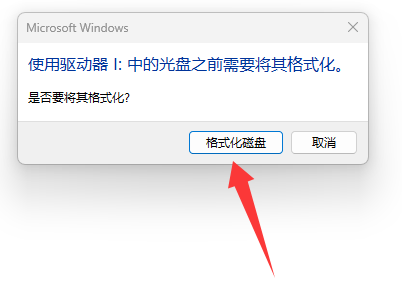

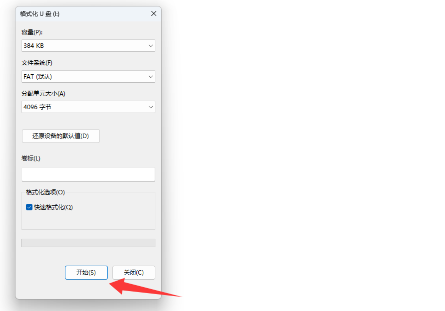

3. 将新固件（`.bin`）文件拖进 U 盘；

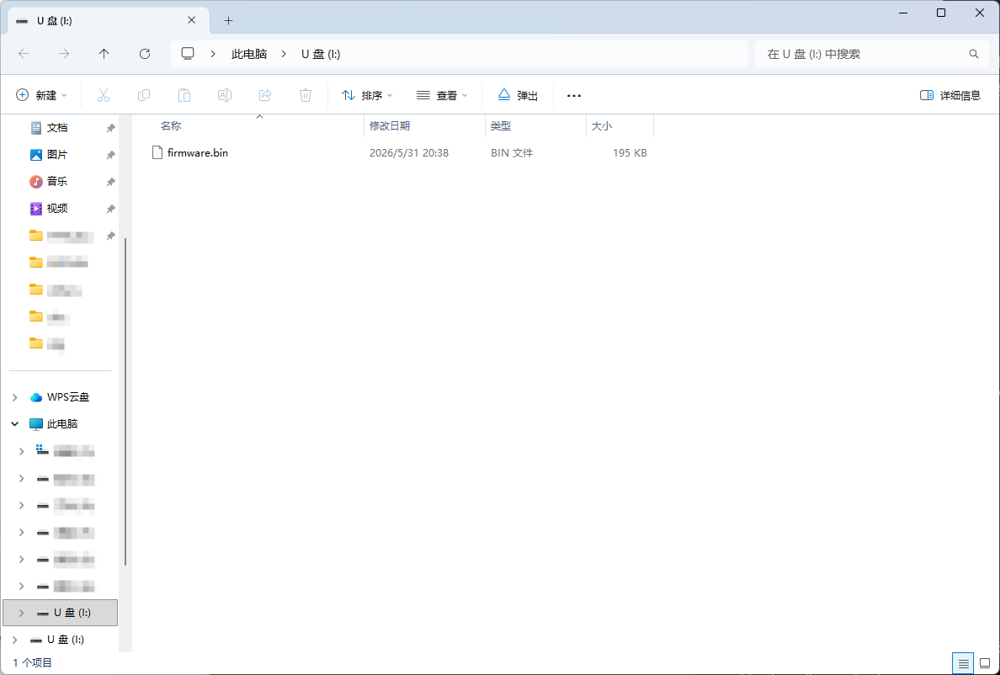

4. 根据 OLED 显示，按键 W 代表方向上，按键 S 代表方向下，按键 Enter 代表确认，此时选择 Reboot 并按下 Enter；
5. 重启后会弹出 U 盘里的固件名字，选择 Enter 后等待几秒升级完毕。

> **注意**：若擦除固件未刷入新固件或者刷错固件，键盘会不能使用，此时不需要紧张，按住 ESC 上电刷入新的固件即可。

## 初次刷入固件

如果芯片是空片，第一次刷入固件，则上电默认会启动到 ROM boot，此时需要先刷出产固件（代码中打开 `FIRST_USED` 宏）进入 U 盘模式手动将 DataFlash 格式化或者将 DataFlash 刷入 `DefaultFS.BIN`。若刷固件时不小心擦除了 DataFlash 也必须按照本节的方法重新刷出产固件。

刷入固件后上电提示 `FATFS-FAIL`，此时表示 DataFlash 格式错误。若刷入的是出产固件（代码中打开 `FIRST_USED` 宏）则会弹出 U 盘，选择格式化后重启键盘（这里不能使用 `Fn + R`，只能重新通过开关上电）。重启键盘后不会提示 `FATFS-FAIL`，此时键盘的配置已经写入。

此时通过上面的方法刷入正式版（去掉 `FIRST_USED` 宏）固件。若新的固件配置与出产固件配置不一致，详见 [同步固件的最新改动](#同步固件的最新改动) 章节。

## 按键与切层

TP78 自带 2 层，默认使用 **Capslock** 按键切层。

**切层方式**：长按 Capslock 切到另一层，抬起返回第一层。若先抬起 Capslock，按下第二层按键未被抬起，将保持按键，直到按键抬起。

**Fn 设计规则**：Fn 位置在上电后会被定死，防止配列被随意修改导致无法复位键盘。

## 同步固件的最新改动

固件的升级经常伴随对配置的改动，例如新增一些配置（例如：旧版本不支持小红点速度修改，新版本支持了该功能），但是在升级固件时不会自动更新旧的配置。相对地，通过按下 5 次 Fn 会重置配置到当前固件支持的最新版本，但是会丢失原来一些偏好配置（例如：原先配置默认背光模式为常亮，重置后默认背光会恢复为呼吸灯）。此时只能通过 U 盘模式来把旧的配置文件导出，之后按下 5 次 Fn 重置后，按下 `Fn + U` 重启键盘并再次进入 U 盘模式，再一行一行将配置文件进行核对。

## OLED UI 介绍

### 主层级

- **KeyStatus** - 显示键盘状态的一些参数
- **KeyCfg** - 设置键盘一些配置
- **Debug** - 普通用户无需关注

### KeyStatus 层级

| 参数 | 说明 |
|------|------|
| bat_adc | 电池电量 ADC 值 |
| last_ver | 上一个固件版本号（该功能记录上一次刷入的固件版本以便进行问题追溯，从 V2.1.10 版本开始再刷入 V2.1.10 之后的版本会进行记录，否则会显示 Empty） |
| capmouse U/D/L/R | 触摸板电容通道值（键盘默认使用触摸条，无需关注） |
| touchbar L1/L2/L3/M/R1/R2/R3 | 触摸条从左到右电容通道值 |

### KeyCfg 层级（修改内容断电保存配置）

| 参数 | 范围 | 说明 |
|------|------|------|
| BLEdevice | 0~3 | 蓝牙多设备连接号 |
| LEDstyle | 0~5 | 默认背光模式 |
| 3Mode | 0~3 | 0=USB 模式，1=蓝牙模式，2=2.4G RF 模式，3=USB 蓝牙共存模式 |
| UDISKmode | 0~1 | 1 代表下次启用 U 盘模式 |
| MPRspeed | - | 无需关注，请保持默认值 |
| MPRparam6 | - | 无需关注，请保持默认值 |
| MPRparam7 | - | 无需关注，请保持默认值 |
| tpSpd_div | 1~9 | 小红点减速系数，越大小红点移动越慢 |
| Brightness | 1~255 | 亮度，请不要修改太大，容易供电不足导致异常 |
| RF_freq | 0~9 | RF 频段，每 1 档间隔 0.025GHz，非必要请勿修改（需重启生效） |
| Tbtn_en | 0~1 | 是否使能触摸条触发鼠标按键（需重启生效） |
| idle_cnt | 1~65535 | 无操作进入屏保的大约时间，单位：秒（需重启生效） |
| lp_cnt | 1~65535 | 无操作进入睡眠的大约时间，单位：秒（需重启生效，需大于 idle_cnt） |
| RF_chk_ms | 1~255 | RF 发起重传检测机制的判定时间，单位：秒（需重启生效） |
| motor_en | 0~1 | 使能触摸条触发马达振动（需重启生效） |
| auto_mouse | 0~255 | 自动鼠标键功能，配置为非 0 生效（单位：25ms × 值） |
| mac_mode | 0~1 | 0=Windows/Linux，1=macOS（需重启生效） |

## VIA 改键工具介绍

TP78 支持 VIA 网页改键。layout 布局获取方法：下载 TP78 Integrated Tools 后自动同步最新布局文件到buffer目录。

或者使用新版自建 VIA 网址：<https://via.modtrack.top/>，使用新版网址无需导入 layout。新版自建 VIA 教程请参考：《TP78v3指导文档》

**QMK 官方 VIA 改键网址**：<https://usevia.app/>。

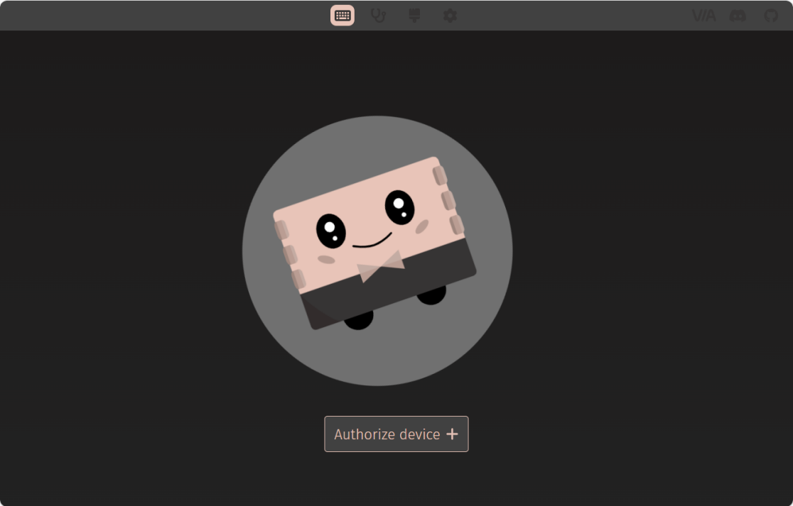

### 加载布局文件

第一次使用需要点击刷子(Design)工具，之后点击 Load 导入 TP78 的键盘布局文件（`TP78v2_layout.json`）。注意：如果找不到刷子图标，在设置中打开"Show Design tab"选项。

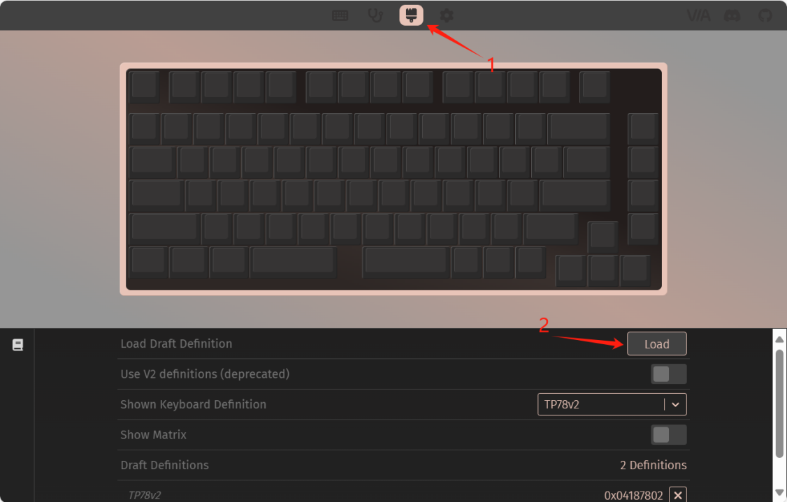

### 进入改键页面

回到第一张图（若已经导入过布局文件可以跳过上一步）并点击"Authorize device"，此时已经进入改键页面。

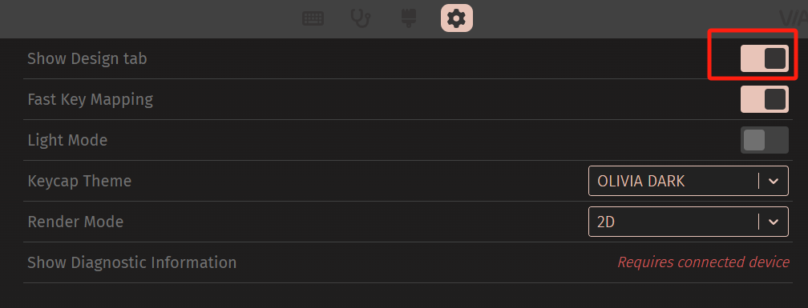

### 修改按键映射

点击任意按键后选择下方的 BASIC 按键直接修改生效并保存，例如在 layer2 层 Z 位置增加按键 A，可以按下图修改。

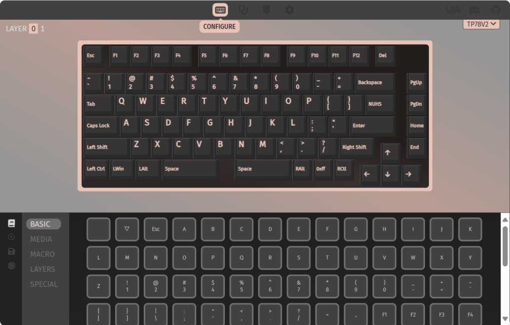

修改后，按住 `Capslock + Z` 相当于按下 `A`。

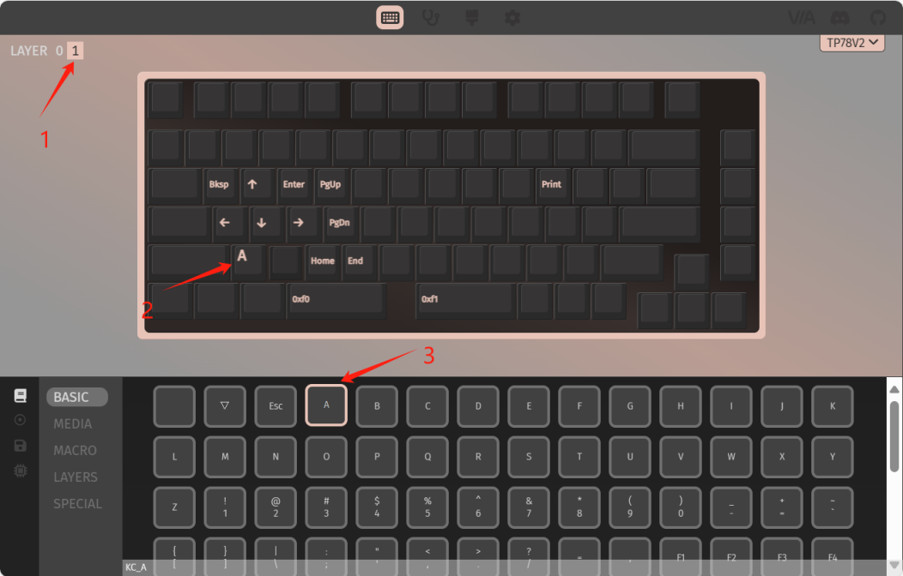

### 按键宏的设置

点击 MACRO，M0~M6 为宏按键，可以实现 1 个按键触发不同组合键，其中 M5 和 M6 为触摸条左右滑动触发的宏按键。宏按键设置方法与普通按键一致。

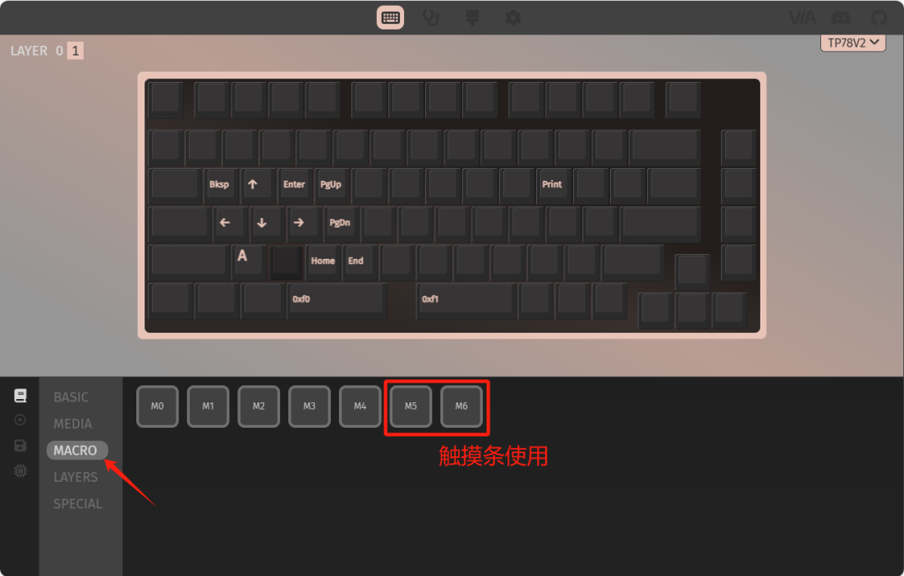

点击左下方第二个图标可以录入宏按键，TP78 支持单个宏按键实现 6 个按键同时按下的组合，但目前不支持 delay 模式。

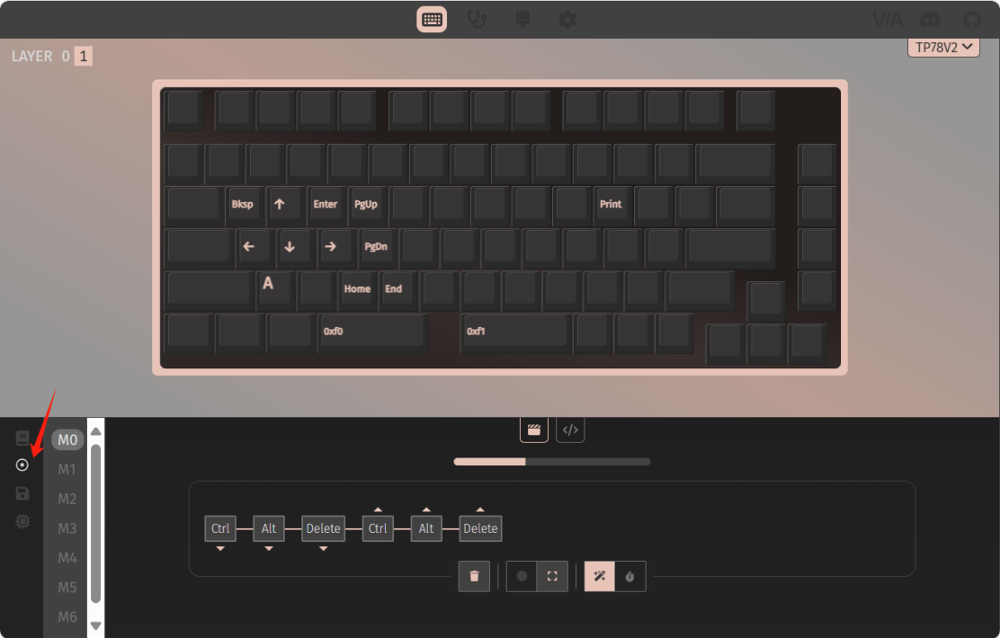

按键宏矩阵索引说明：

| Index 0 | Index 1 | Index 2 | Index 3 | Index 4 | Index 5 | Index 6 | Index 7 |
|---------|---------|---------|---------|---------|---------|---------|---------|
| 功能键 | 保留 | Key0 | Key1 | Key2 | Key3 | Key4 | Key5 |

每一行代表宏按键按下后产生的组合键标准键盘 HID 编码值。

### 键盘配置修改

点击左下方第四个图标可以修改 TP78 配置。

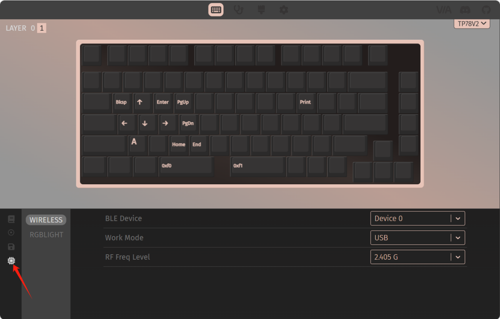

> 注：VIA 改键页面顶部的菜单栏依次对应"按键映射"、"宏"、"键盘配置"等菜单。除此之外，键盘测试、按键编码生成、HID 抓取等高级功能请使用 **TP78 Integrated Tools** 工具。

## U 盘模式介绍

TP78 通过一块固定的 dataflash 记录按键编码和配置信息，并且该区域搭载一个 FAT 文件系统。进入 U 盘模式，可以直接对 U 盘中的 TP78 按键以及配置修改，U 盘模式可以修改 TP78 的所有可改配置，包括 OLED UI 和 VIA 模式下无法修改的部分。

按 `Fn + U` 进入 U 盘模式，在该模式下 VIA 功能不能使用。查看 U 盘中的 TP78 配置文件。

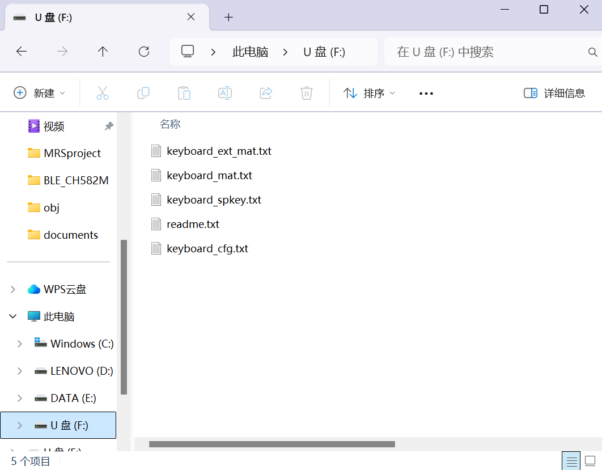

U 盘模式中的配置修改可以直接参考 `readme.txt`。

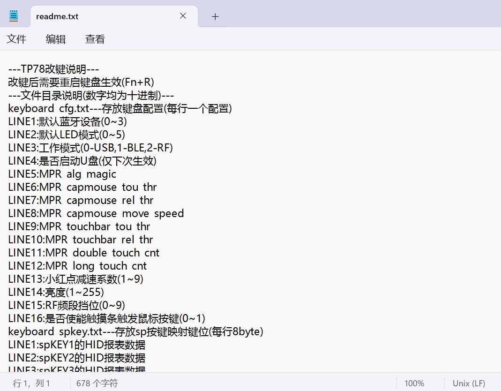

例如：修改背光的默认模式可以直接打开 `keyboard_cfg.txt`，修改文件的第二行。

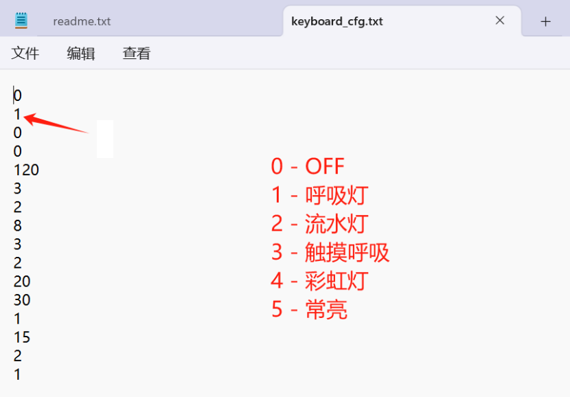

U 盘模式中同样可以修改按键编码，其中主键盘层的编码矩阵存放在 `keyboard_mat.txt`，额外键盘层的编码矩阵存放在 `keyboard_ext_mat.txt`。通过 `tp78_config_tool.exe` 可以生成键盘矩阵的编码。

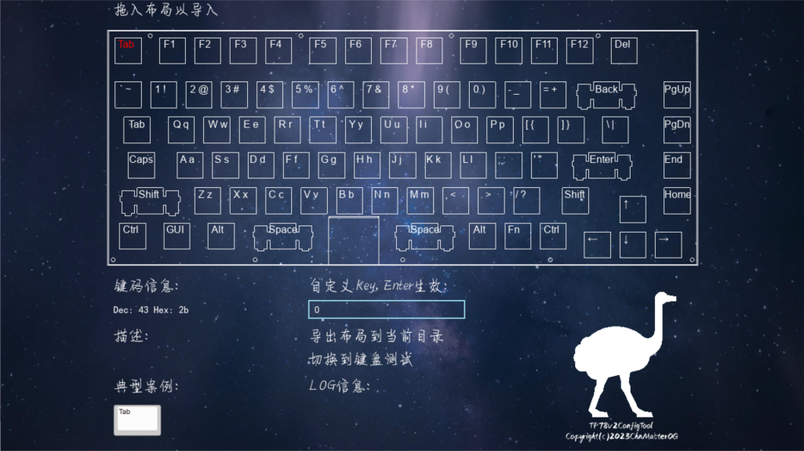

通过修改 `keyboard_spkey.txt` 来修改 TP78 的按键宏，其中每一行代表宏按键按下后产生的组合键标准键盘 HID 编码值。

也可以通过 `tp78_config_tool.exe` 的键盘测试工具中的 log 信息获取。例如：同时按下 1、2、3 的 HID 编码值为 `0 0 30 31 32 0 0`。

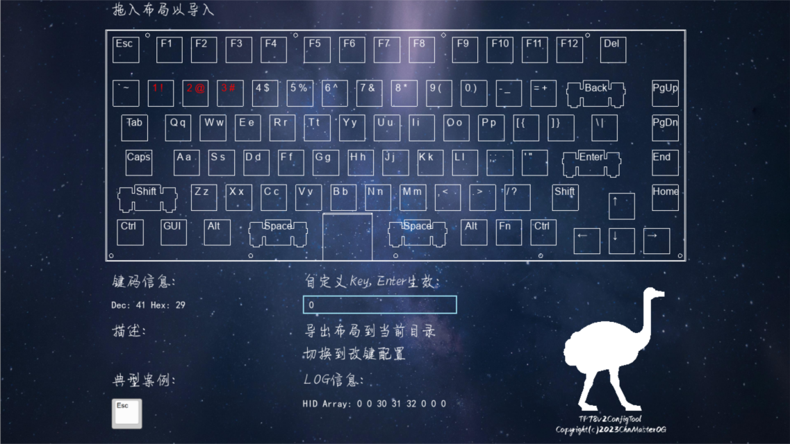

## 图标示意

| 图标 | 说明 |
|------|------|
|  | USB 模式但未检测到 USB 连接 |
|  | USB 模式且已检测到 USB 连接 |
|  | 蓝牙模式但未连接上蓝牙 |
|  | 蓝牙模式且已连接。连接上设备 1 左上角红色点会填充显示；连接上设备 2 右上角红色点会填充显示；连接上设备 3 右下角红色点会填充显示；连接上设备 4 左下角红色点会填充显示 |
|  | 当前处于 2.4G 模式 |
|  | 大小写 Capslock 灯指示 |
|  | 小键盘 Numlock 灯指示 |
|  | 已连接上 TP78foc 扩展模块 |
|  | 已连接上 TP78mini 扩展模块 |
|  | 已连接上 Salieri 扩展模块 |
|  | 共存模式下数据通过 USB 发送 |
|  | 共存模式下数据通过蓝牙发送 |

## 教程视频

| 内容 | 链接 |
|------|------|
| TP78v2 介绍 | <https://www.bilibili.com/video/BV1Ho4y1b78t> |
| TP78v3 介绍 | <https://www.bilibili.com/video/BV17P7DzeEUf> |
| TP78 扩展模块介绍 | <https://www.bilibili.com/video/BV1jVpneNEpq> |
| TP78 组装 | <https://www.bilibili.com/video/BV16m411R7Hc> |
| TP78mini 组装 | <https://www.bilibili.com/video/BV1bC4geBEWH> |

## github 代码适配

github 上代码固件仅适配带 kboot 的 tp78 版本，若需要基于此进行开发或者 DIY，需将 `Link.ld` 文件 FLASH 的起始地址修改为 `0`。

若存在其他问题，请在技术交流 QQ 群：678606780 (1群), 904775488 (2群) 中提问。

## 相关资料获取

**WCHISPTool 工具**：见 WCH 沁恒微电子官网下载。

**TP78 Integrated Tools**：在[GitHub 仓库](https://github.com/ChnMasterOG/TP78-Integrated-Tools/releases)或群里获取。