# TP78v3 指导文档

- **文档版本**：1.1.4
- **TP78v3 固件版本**：3.3.4

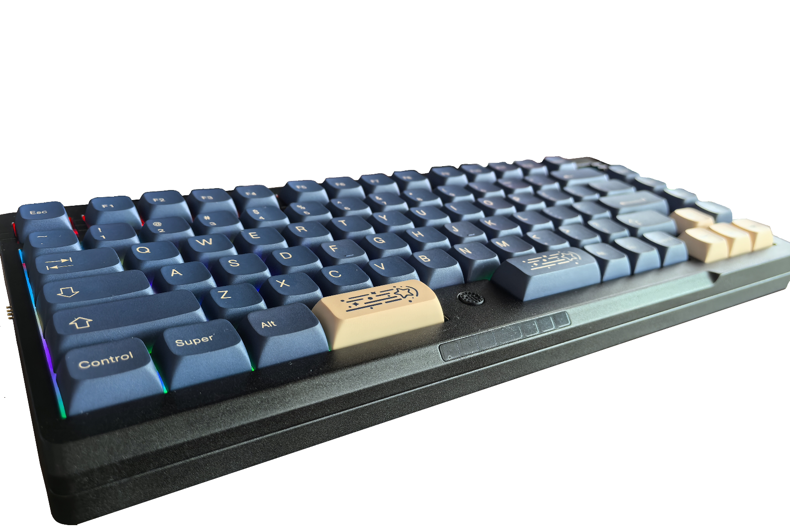

## 前言

TP78v3 是基于海思 SoC Hi2821/Hi2821E(TP78v3e) 的三模机械键盘方案。

**芯片特性**：USB2.0 高速（8K 回报率）、BLE5.4、星闪 SLE1.0 连接，硬件按键扫描功能。

**TP78v2 全功能软件支持**：包括小红点、触摸条控制，OLED 显示，磁吸扩展接口。

**TP78v2 硬件适配**：只需更换 TP78v2 的主键盘核心板。

**新功能**：支持下位机宏录制，与 TP78v3 配套星闪鼠标、SLE 接收器支持键鼠宏控制，通过星闪连接可直连华为星闪设备（无需接收器）。

**配列修改功能**：通过配列修改工具可以任意修改配列，启用/关闭键盘相关功能。

**固件版本说明**：3.1.0 后的版本使用的 Hi2821E 主控（TP78v3e）。如果是在开团或者其它渠道购买的 TP78v3，未特殊说明均使用的是 TP78v3e。

## 修订记录

| 日期 | 内容 |
|------|------|
| 2024/4/15 | 适配固件版本 V3.0.0 |
| 2025/6/12 | 适配固件版本 V3.1.1 |
| 2025/6/19 | 适配固件版本 V3.1.2 |
| 2025/9/17 | 适配固件版本 V3.1.3 |
| 2025/9/27 | 适配固件版本 V3.1.4 |
| 2025/10/25 | 文档勘误：更改 via 改建中宏按键功能的说明，V3 支持带延迟的宏按键功能，V2 不支持带延迟的宏按键功能。 |
| 2025/10/25 | 适配固件版本 V3.1.5 |
| 2025/12/4 | 适配固件版本 V3.1.6 |
| 2025/12/6 | **【重要】** 适配固件版本 V3.2.0 |
| 2025/12/18 | 增加键盘部分使用说明 |
| 2026/1/18 | **【重要】** 适配固件版本 V3.3.0 |
| 2026/3/7 | 修复文档部分章节说明的错误 |
| 2026/3/14 | 适配固件版本 V3.3.1 |
| 2026/6/28 | **【重要】** 适配固件版本 V3.3.3 并更新指导文档格式 |
| 2026/7/19 | 适配固件版本 V3.3.4 |

## 固件更新说明

### V3.0.0
- TP78v3 首次发布

### V3.1.1
- TP78v3e 首次发布
- 增加支持 Windows 动态光效

### V3.1.2
- 增加支持接收器 DFU 模式更新固件

### V3.1.3
- 增加 auto_mouse 功能，并增加对应配置项。打开后移动小红点期间会自动把键盘切到第二层，并在停止移动的时候自动切回第一层
- 增加五次 Fn 重置固件期间，按任意其它按键打断重置计数的功能

### V3.1.4
- 修改 Fn 功能的判定逻辑：原逻辑为松开 Fn 执行功能，修改后的逻辑为松开 Fn 或者另一个按键执行 Fn 功能
- 增加适配 VIA 中设置 TO 键切层功能：按键设定 TO(0) 可以直接切到第 0 层，设定 TO(1) 可以直接切到第 1 层
- Capslock 功能修改为按住切到第 1 层：原功能为按住切换到另一层（当前层是 1 则切换为 0，当前层是 0 则切换为 1）；auto_mouse 功能修改为触发期间切换到第 1 层：原功能也是触发期间交换两层

### V3.1.5
- 增加 KEY_TP_MAP_SCROLL 键（VIA 对应 TP Map Scroll 按键），按下后小红点 Y 方向移动变成 Z 方向移动，再次按下后取消

### V3.1.6
- 增加待机时 OLED 亮度降低功能
- 修复通过 VIA 改鼠标中键无法正常使用的问题
- 修复 Fn 键默认位置不对的问题

### V3.2.0 【重要更新】
- 交换固件行列，必须更新到该版本或以后，否则通过 VIA 查看的行列配置是相反的

### V3.3.0 【重要更新】
- 支持华为星闪设备直连功能。可以通过鸿蒙系统的星闪功能直接连接 TP78v3。更新到该版本前，需要先将接收器更新到对应 V3.3.0 版本，之后再升级主固件。否则新版本主固件无法适配旧版本接收器固件
- 修复休眠后唤醒可能马上导致再进入休眠的 BUG

### V3.3.1
- 修复按键无法重置低功耗计数器的问题
- 更新扩展模块协议到 V1.1.0：增加扩展模块更新主键盘部分配置的接口
- 增加适配扩展模块 Salieri

### V3.3.3 【重要更新】
- 更新键码存储格式（更新后需要按下5次 Fn 重置后才能正常使用）
- 支持 Modtrack 新 VIA 网页通信协议
- 修复 V3.3.1 版本接收器无法正常连接的 BUG
- **此次升级后需要按5次Fn重置生效**

### V3.3.4
- 增加MO、LT、TG切层控制
- 删除Capslock固定切层功能，改成LT1(Caps)
- **此次升级后需要按5次Fn重置生效**

## 快速上手

- **选择 USB 有线连接**：按下 `Fn + F10`

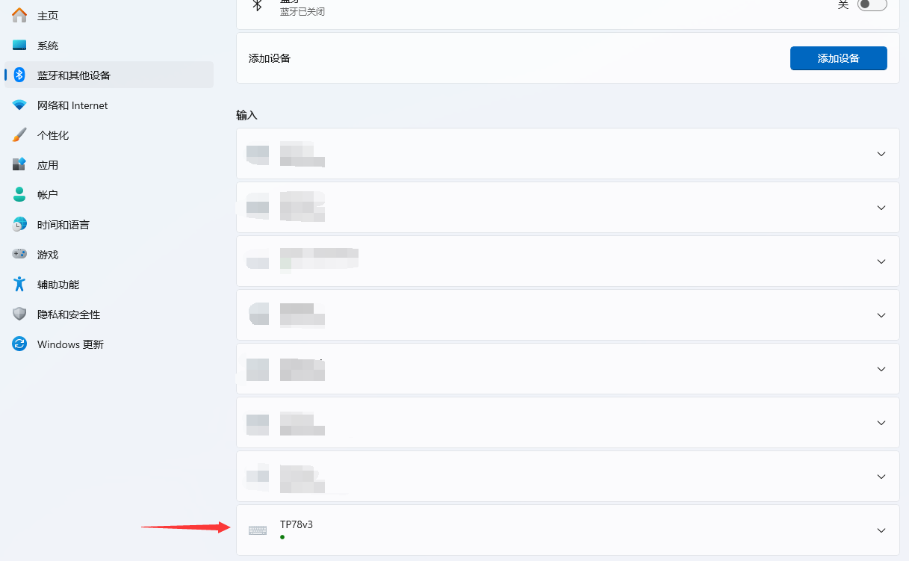

- **选择蓝牙无线连接**：按下 `Fn + F11`

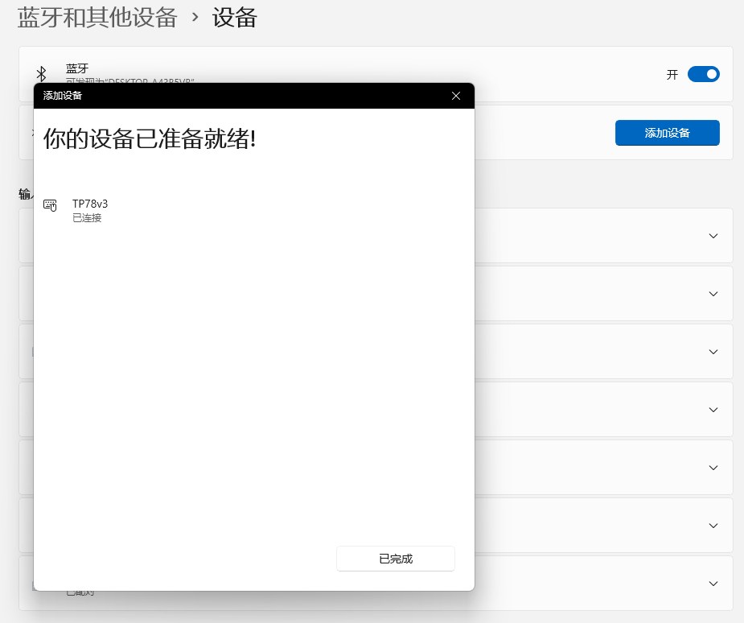

- **选择星闪无线连接**：按下 `Fn + F12`

**使用接收器**

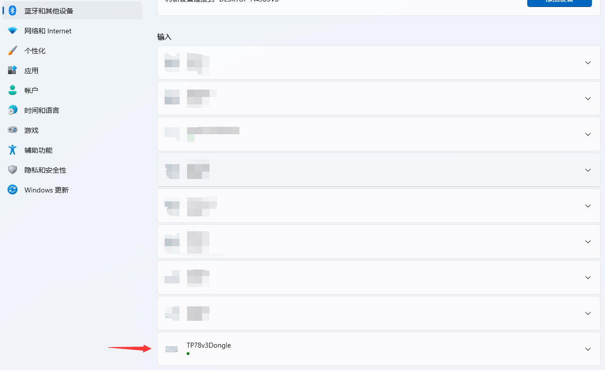

**使用华为星闪直连**

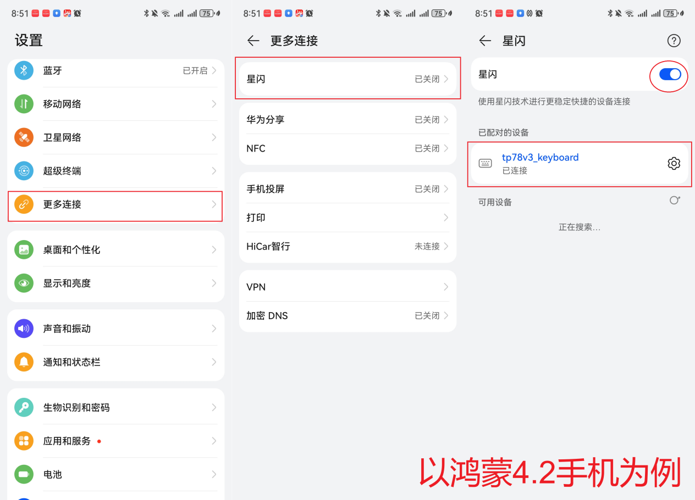

## Fn 键功能一览

| 功能 | 按键组合 | 说明 |
|------|----------|------|
| 重置键盘配置 | `Fn` × 5 | 直至 OLED 提示 Reset OK 前请勿掉电 |
| OLED 参数配置 | `Fn + O` | 进入 OLED 参数配置界面。W/S 上下移动，A/D 选择退回/进入菜单，Enter 确定，Esc 返回 |
| USB 模式 | `Fn + F10` | 切换为 USB 有线模式 |
| 蓝牙模式 | `Fn + F11` | 切换为蓝牙无线模式 |
| 星闪模式 | `Fn + F12` | 切换为 SLE（星闪）无线模式 |
| 接收器复位 | `Fn + Esc` | 让接收器复位 |
| 接收器进 DFU 模式 | `Fn + ~` | 键盘连接上接收器后按下会让接收器进入 DFU 升级模式 |
| 减小音量 | `Fn + -` | 减小音量 |
| 增大音量 | `Fn + +` | 增加音量 |
| 宏按键直发 | `Fn + D` | 设置/取消按键宏直发功能（仅 SLE 模式有效） |
| 切换宏下标 | `Fn + Z` | 切换接收器保存的按键宏下标（仅 SLE 模式有效） |
| 采集按键宏 | `Fn + X` | 接收器开始/停止按键宏采集（仅 SLE 模式有效） |
| 清除按键宏 | `Fn + C` | 清除接收器按键宏（仅 SLE 模式有效），目前只支持一键清除所有 |
| 开关小红点 | `Fn + T` | 打开或关闭小红点，同时开关触摸条鼠标左右击功能 |
| 开关触摸条 | `Fn + Y` | 打开或关闭触摸条滑动功能 |
| 蓝牙多设备切换 | `Fn + 1~4` | 切换蓝牙设备，下电后保存 |
| 清除蓝牙绑定 | `Fn + 0` | 清除所有绑定信息 |
| 背光模式切换 | `Fn + F1~F7` | 关闭/呼吸灯/流水灯/触控呼吸/彩虹灯/固定亮度/自定义效果 |
| 复位键盘 | `Fn + R` | 复位键盘 |
| 版本显示 | `Fn + Del` | 查看/关闭固件版本 |

## 升级固件的方法

### 固件发布位置

<https://github.com/ChnMasterOG/tp78_v3_open/tree/main/firmware/tp78_v3e>

- **主键盘固件**：`主键盘3.X.X_release.fwpkg`
- **接收器固件**：`接收器3.X.X_release-USB OTA下载.fwpkg`

使用华为的 **BurnTool** 工具（名称：`BurnTool.exe`）。下载地址：[见相关资料获取章节](#相关资料获取)

### 使用 Bootloader 下载主固件分区（适用于主键盘固件更新）

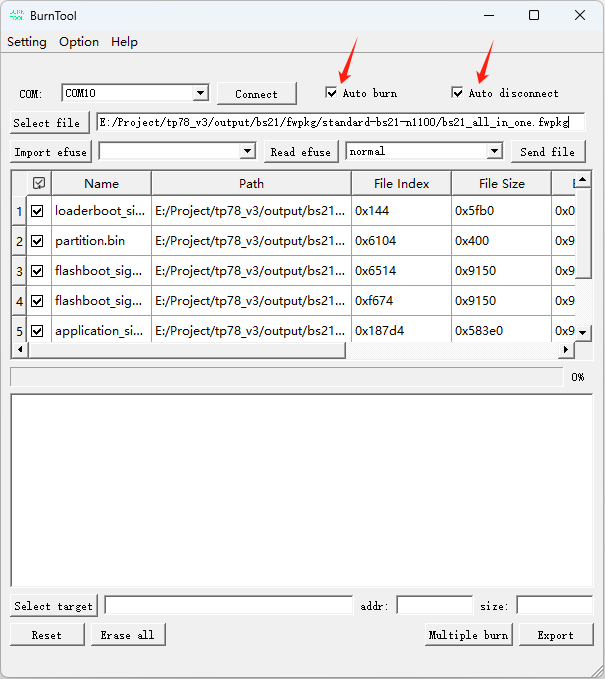

使用步骤：

1. 打开 `BurnTool.exe`
2. `Option -> Change chip -> Chip List` 选择 **BS21**
3. 选择 COM 端口为 TP78v3 对应的串口
4. 勾选 **Auto burn** 和 **Auto disconnect**
5. 选择打包好的固件包（后缀 `.fwpkg`），固件包中含 `application_sign.bin` 分区
6. 点击 **Connect**
7. 主键盘按下核心板上的轻触开关或者 `Fn + R` 复位进入下载；接收器按下 PCB 板上的轻触开关（若有）/短接 RST（若有）触发复位，或者键盘连接上接收器并按下 `Fn + Esc` 让接收器复位进入下载
8. 下载完成后断电重新上电，等待一段时间即可更新成功（BS21E 使用 5.0.39 版本更新会自动复位，无需重新上电）

> **注意**：Demo 版本可以正常开机，但用官方的完全版固件（包括配列修改）只支持官方购买的核心板！

### 通过 DFU 模式 OTA 主固件分区（适用于无串口的 NANO 接收器）

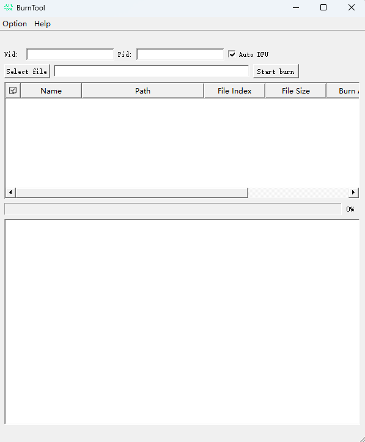

使用步骤：

1. 打开 `BurnTool.exe`
2. 点击 **Change chip**，选择 **BS21-USB**
3. 让接收器进入 DFU 模式：通过主键盘连接接收器后按下 `Fn + F1`
4. 首次需要安装 WinUSB 驱动（见 [WinUSB 驱动章节](#winusb驱动)）
5. 点击 **Auto DFU**
6. 输入 Vid：`0x2418`，Pid：`0x7803`
7. 选择对应的 FOTA 固件
8. 点击 **Start burn**，升级完成后接收器会自动复位，等待几秒钟后就能升级成功

> **注意**：
> - 选择固件时需要选择 **FOTA 固件**，否则会出现刷完不生效的情况！
> - **非必要情况尽量不升级接收器固件！**
> - 接收器固件有专门的 `fota.fwpkg` 固件，文件大小相对比主键盘的小，解析后不会出现 `application_sign.bin` 分区，烧录前请详细甄别。

## WinUSB 驱动

使用 **Zadig** 工具。下载地址：[见相关资料获取章节](#相关资料获取)

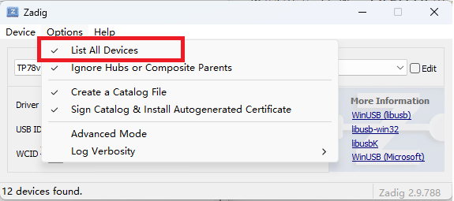
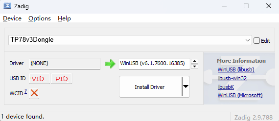

使用步骤：

1. 先让接收器进入 DFU 模式
2. 打开 `Zadig.exe`
3. 勾选 **List All Devices**
4. 选择 **TP78v3 接收器** 设备，点击 **Install Driver** 安装驱动

> **注意**：一定要先进入 DFU 模式再打开 Zadig 去安装 WinUSB 驱动。没进入 DFU 模式安装驱动后，必须从控制面板去卸载驱动，否则无法恢复 USB HID 驱动导致接收器用不了。

## 按键与切层

TP78 自带 2 层，默认使用 **Capslock** 按键切层，此时 Capslock 被定义成 LT1(Caps) 按键。

**默认切层方式**：长按 Capslock 切到另一层，抬起返回第一层；短按 Capslock 不切层，相当于普通按下并抬起 Capslock 按键。

除了自带切层功能外，TP78 还支持以下 QMK 传统切层方式：

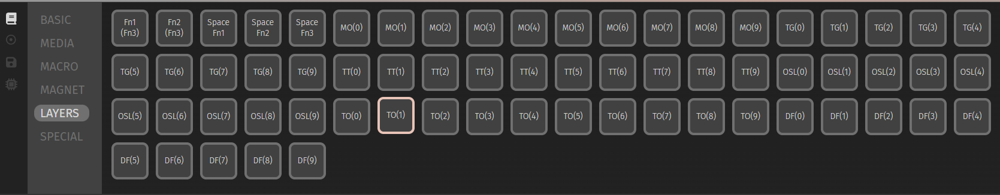

- **TO(n) 切层**：按下后切到第 n 层
- **MO(n) 切层**：按下后切到第 n 层，抬起回到原来的层
- **TG(n) 切层**：按下后切到第 n 层，在第 n 层按下相同按键切回第 0 层
- **LT(n, kc) 切层**：长按超过 t 毫秒后切到第 n 层，短按不切层，而是按下并抬起 kc 按键
- **其他切层功能暂不支持**

TG按键切层可以通过设置穿透按键 Transparent 实现：穿透按键设置在第 n 层，会等效成第 0 层的按键

LT按键的按键计时 t 可以在菜单"设置"-"系统设置"-"按键行为"调整：

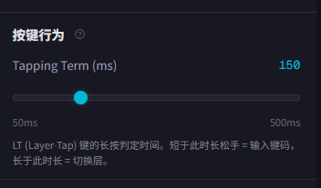

**Fn 设计规则**：Fn 位置在上电后会被定死，防止配列被随意修改导致无法复位键盘。

## 灯光效果

TP78v3e 自带 **6+1** 种背光模式：

| 编号 | 模式 | 说明 |
|------|------|------|
| 1 | 关闭背光 | - |
| 2 | 呼吸灯 | 亮度可通过 OLED UI 或者 VIA 配置 |
| 3 | 流水灯 | - |
| 4 | 触控呼吸 | 按下的键渐灭，亮度可通过 OLED UI 或者 VIA 配置 |
| 5 | 彩虹灯效 | - |
| 6 | 常亮 | 亮度可通过 OLED UI 或者 VIA 配置 |
| - | 以上 6 种灯效在扩展模块连接时会同步效果 |
| 7 | 自定义 | 灯效通过电脑组件控制，目前支持 Windows 动态光效控制 |

**Win11 动态光效**：在设置中可以找到动态光效组件：

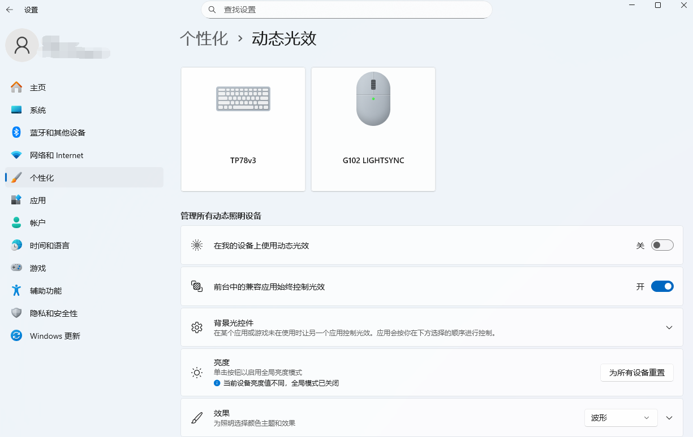

通过打开"在我的设备上使用动态光效"可以直接在键盘上应用动态光效。

> **注意**：动态光效必须处于 **USB 模式** 且连接上电脑才能使用，无线模式都不能使用。

## OLED UI 介绍

### 主层级

- **KeyStatus** - 显示键盘状态的一些参数
- **KeyCfg** - 设置键盘一些配置
- **Debug** - 普通用户无需关注

### KeyStatus 层级

| 参数 | 说明 |
|------|------|
| bat_adc | 电池电量 ADC 值 |
| capmouse U/D/L/R | 触摸板电容通道值（键盘默认使用触摸条，无需关注） |
| touchbar L1/L2/L3/M/R1/R2/R3 | 触摸条从左到右电容通道值 |

### KeyCfg 层级（修改内容断电保存配置）

| 参数 | 范围 | 说明 |
|------|------|------|
| BLEdevice | 0~3 | 蓝牙多设备连接号 |
| LEDstyle | 0~5 | 默认背光模式 |
| 3Mode | 0~2 | 0=USB模式，1=蓝牙模式，2=星闪模式 |
| tpSpd_div | 1~9 | 小红点减速系数，越大小红点移动越慢 |
| Brightness | 1~255 | 亮度，请不要修改太大，容易供电不足导致异常 |
| Tbtn_en | 0~1 | 是否使能触摸条触发鼠标按键（需重启生效） |
| idle_cnt | 1~255 | 无操作进入屏保的大约时间，单位：5秒（需重启生效） |
| lp_cnt | 1~255 | 无操作进入睡眠的大约时间，单位：5秒（需重启生效，需大于 idle_cnt） |
| motor_en | 0~1 | 使能触摸条触发马达振动（需重启生效，TP78v3 不支持，TP78v3e 不建议打开） |
| auto_mouse | 0~255 | 自动鼠标键功能（单位：5个小红点检测周期），建议值：100 |

## 改键工具介绍

TP78 支持 modtrack VIA 网页改键（网页更新可能导致截图非最新版本，图例仅供参考）。

1. 打开 modtrack VIA 改键网址：<https://via.modtrack.top/>
2. 选择"TP78v3"键盘并点击"连接键盘"

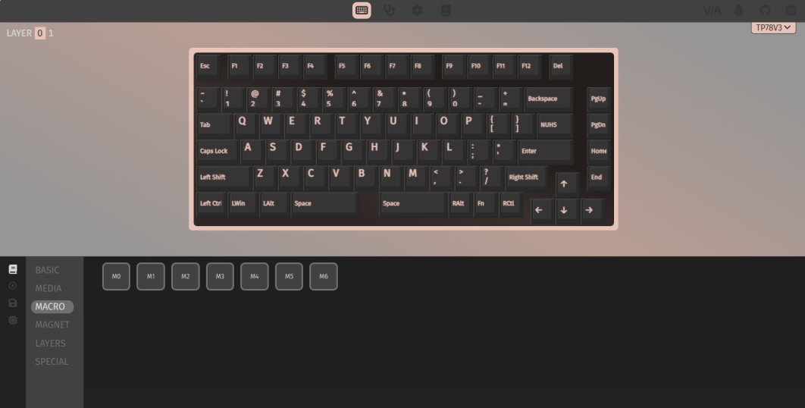

> **注意**：TP78v3 使用 64byte 包传输 USB 报文，目前官方版本的 VIA 存在 BUG 无法识别 64byte 报文的 Macro 键，因此建议使用 **Modtrack VIA 改键网址** 进行改键！

### Modtrack VIA 功能

**"按键映射"功能**：修改不同按键的功能

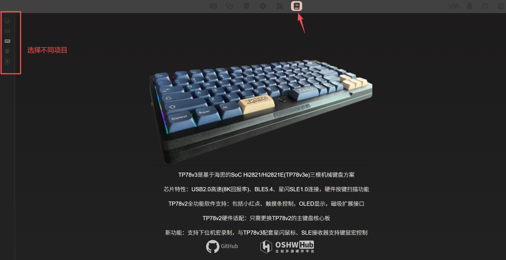

**"灯效"功能**：快速配置灯光效果（现在当前灯光效果会被显示在键盘上）

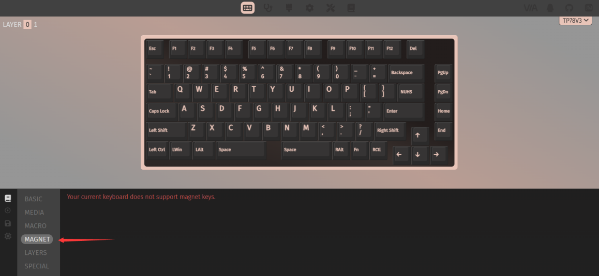

**"宏"功能**：宏按键功能录制和查看

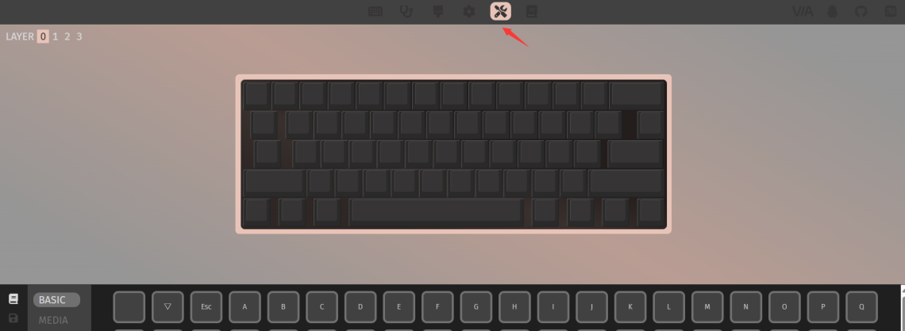

**"配置"功能**：和传统via一样的配置功能

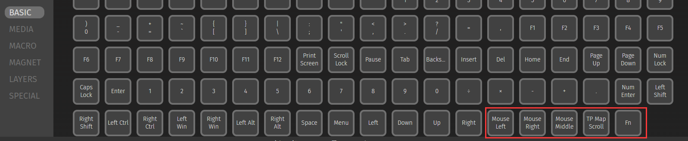

**"调试"功能**：debug使用

**"设置"功能**："重置键盘"功能和"进入bootloader"功能，TP78v3 进入 bootloader即重启键盘

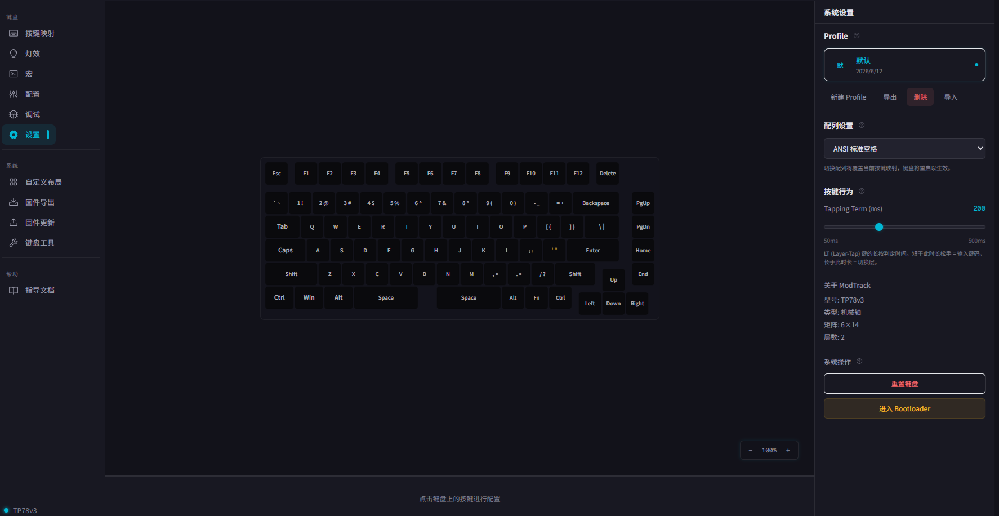

### 适用 TP78v3 的特殊按键（按键映射中的"自定义"按键）

| 按键 | 说明 |
|------|------|
| TP Scroll | 按下后小红点垂直移动切换成滚轮上下移动 |

## 图标示意

| 图标 | 说明 |
|------|------|
|  | USB 模式但未检测到 USB 连接 |
|  | USB 模式且已检测到 USB 连接 |
|  | 蓝牙模式但未连接上蓝牙 |
|  | 蓝牙模式且已连接（四个红点分别对应设备 1~4） |
|  | 星闪模式但未连接 |
|  | 星闪模式且已连接 |
|  | 大小写 Capslock 灯指示 |
|  | 小键盘 Numlock 灯指示 |
|  | 已连接上 TP78foc 扩展模块 |
|  | 已连接上 TP78mini 扩展模块 |
|  | 已连接上 Salieri 扩展模块 |

## BUG 反馈

TP78v3/TP78v3e 开放板级串口，连接 USB 后会枚举串口并打印重要 log。

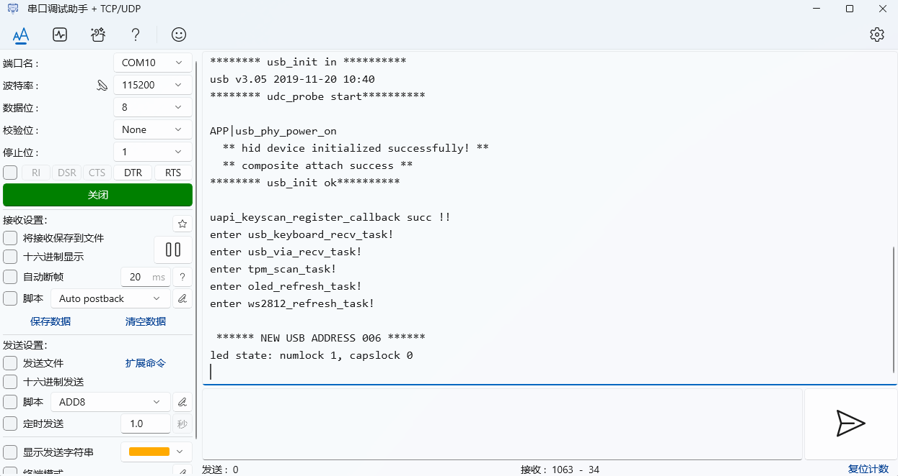

如果在特殊场景出现键盘异常复位，串口会产生 dump 信息，可以将 **目标版本 + 使用场景 + dump 信息** 反馈于：
<https://github.com/ChnMasterOG/tp78_v3_open/issues>

便于后续版本优化迭代。

## 教程视频

| 内容 | 链接 |
|------|------|
| TP78v2 介绍 | <https://www.bilibili.com/video/BV1Ho4y1b78t> |
| TP78v3 介绍 | <https://www.bilibili.com/video/BV17P7DzeEUf> |
| TP78 扩展模块介绍 | <https://www.bilibili.com/video/BV1jVpneNEpq> |
| TP78 组装 | <https://www.bilibili.com/video/BV16m411R7Hc> |
| TP78mini 组装 | <https://www.bilibili.com/video/BV1bC4geBEWH> |

## 相关资料获取

**BurnTool 工具下载地址**：
<https://pan.baidu.com/s/1afIGsfbVTcnJRpsF1WkObw?pwd=TP78> 提取码: TP78

**Zadig 工具下载地址**：
<https://pan.baidu.com/s/16knf3keLnJ_wklego3Q1-g?pwd=TP78> 提取码: TP78

**BS21 & BS21E 参考资料**（非广告，内容仅供参考）：
- [BearPi-Pico H2821 | 小熊派BearPi](https://docs.bearpi.cn/BearPi-Pico_H2821/)
- [BearPi-BM H21E 产品概述 | 小熊派BearPi](https://docs.bearpi.cn/BearPi-BM_H21E/)

**参考代码**：
- BearPi-Pico_H2821：小熊派星闪开发板 BearPi-H2821 Pico 代码
- BearPi-Pico_H2821E：小熊派 BearPi-Pico_H2821E 开发板代码
- fbb_bs2x：星闪 bs21e 解决方案代码仓

## 常见问题

### 蓝牙连接反复断开重连

**现象**：蓝牙连接上键盘，马上断开然后又重连，反反复复无法正常连接。

**原因**：主机蓝牙曾经配对过键盘，但是蓝牙的 NV 区被刷掉了（通过键盘清除绑定信息功能，或者通过 BurnTool 刷掉了 NV 区），导致键盘没有主机的蓝牙配对信息。

**解决方式**：删除主机的配对信息重新配对。

### 接收器无法正常使用

**情况一**：WinUSB 安装后接收器无法正常使用（但接收器没有进 DFU 模式），拔插接收器电脑有反应。

**解决方式**：去"控制面板 - 设备管理器"卸载驱动。然后根据 [WinUSB 驱动章节](#winusb驱动) 方式，先进 DFU 模式后再安装驱动。

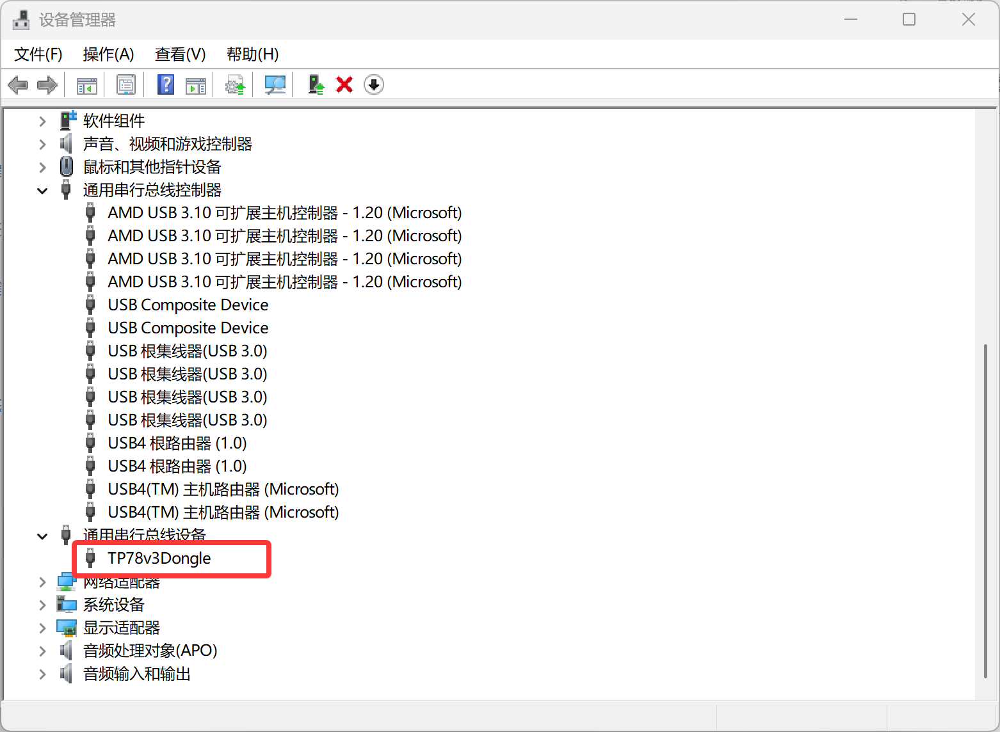

**情况二**：拔插接收器无反应。

**解决方式**：需要拆除外壳重新安装。接收器板子的串口烧录方式：见 [升级固件章节](#使用-bootloader-下载主固件分区适用于主键盘固件更新)，固件选择：
<https://github.com/ChnMasterOG/tp78_v3_open/tree/main/firmware/tp78_v3e/接收器3.X.X_release-串口下载.fwpkg>

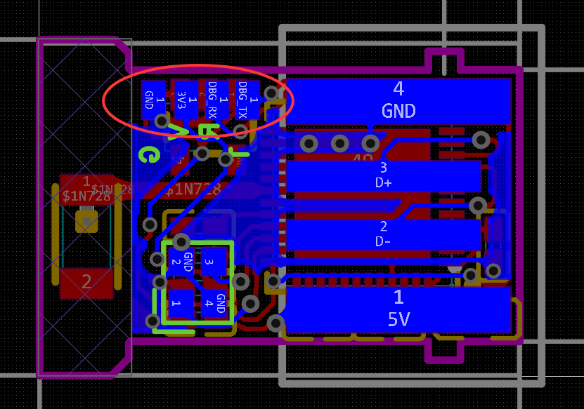
