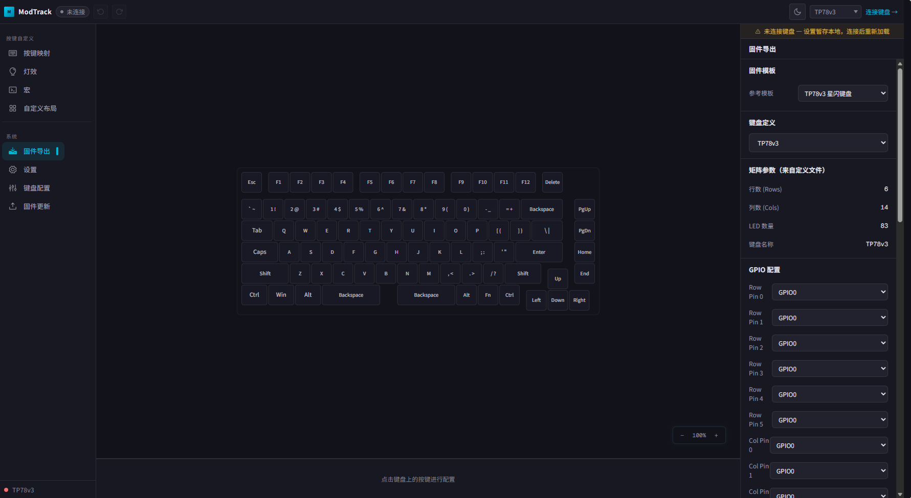
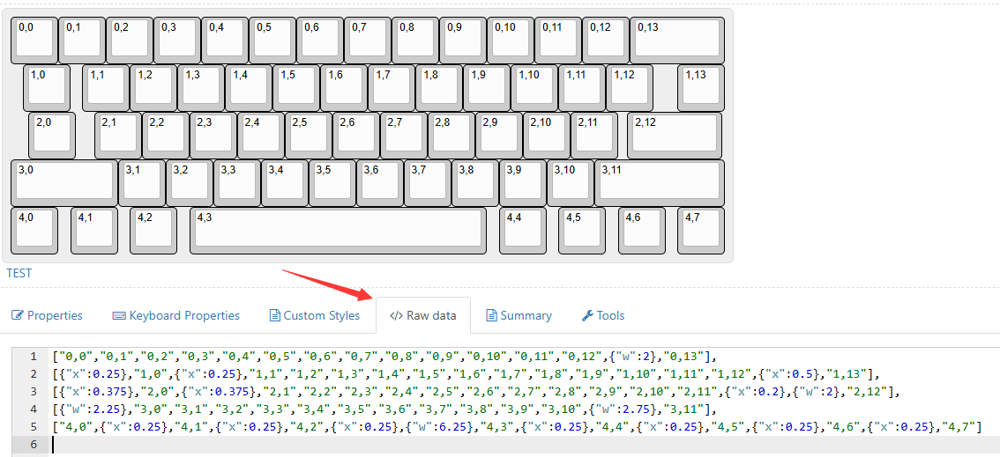
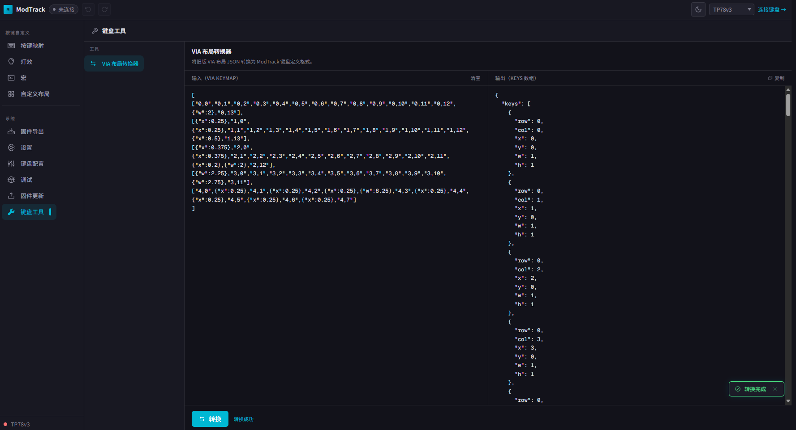
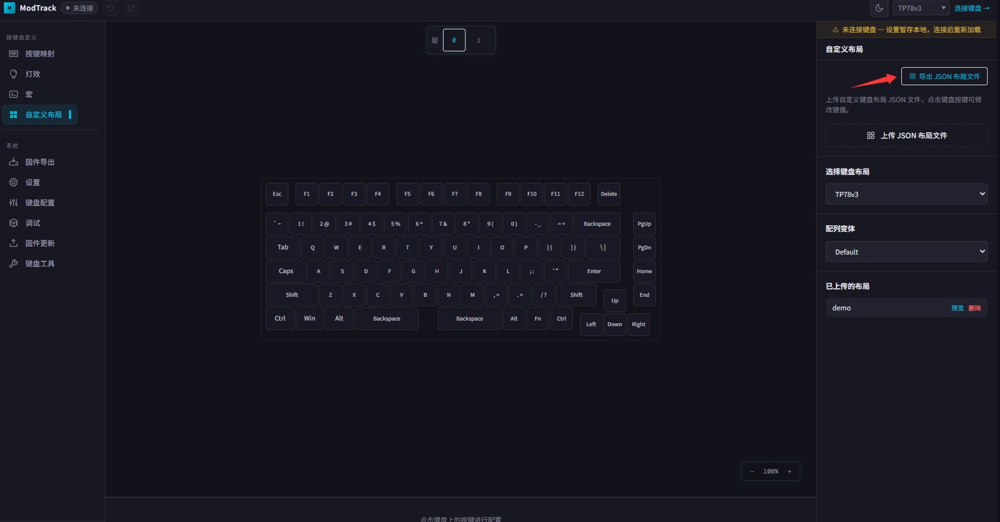
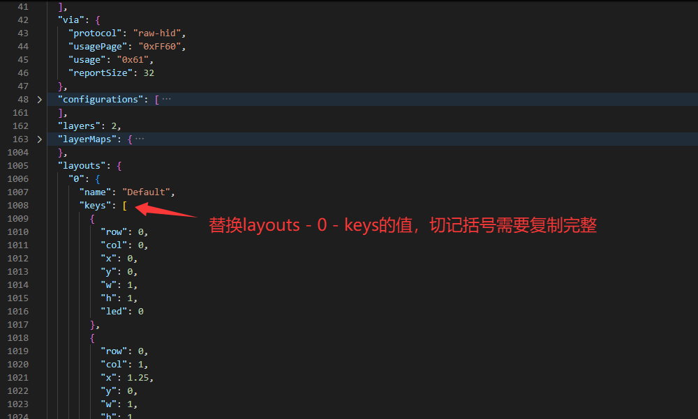
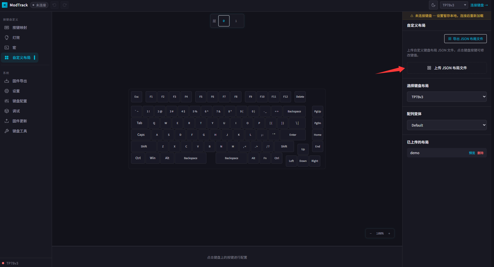
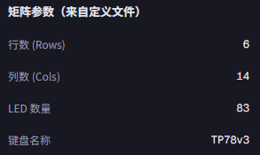
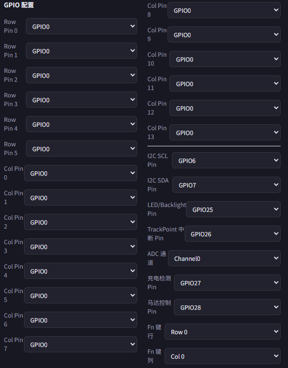
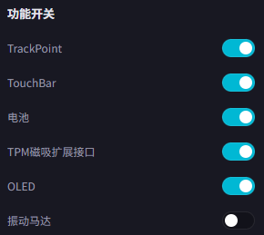

# Modtrack固件自动生成系统 - 指导文档

*文档版本1.0.1*

## 前言

Modtrack固件自动生成系统是一个能够自定义键盘配列和选择键盘功能，并基于现成键盘固件进行修改后导出新固件的自动化系统。改网站适用于没有编程基础或者没有时间研究代码但是需要DIY不同配列键盘的人群。

Modtrack via网址：https://via.modtrack.top

## 修订记录

| 日期         | 内容                  |
| ---------- | ------------------- |
| 2025/10/29 | 首次发布   |
| 2026/7/5 | 更新网页功能，更新固件生成系统介绍        |

# 通用固件更新

Modtrack的固件生成系统依赖via的布局文件，因此需要先构建一个布局文件。通过以下网址绘制自己键盘的布局：https://www.keyboard-layout-editor.com/
这里需要指定每个按键大小、所在行列位置等等，绘制完后点击Raw data将文本框中内容拷贝下来。

在网页中选择"键盘工具"-"VIA布局转换器"，将拷贝的Raw data复制进去，并在最外侧增加一个中括号括起来（即：[ <复制的Raw data> ]）。
点击"转换"，将右侧转换结果复制。

在网页中选择"自定义布局"，并选择布局为：TP78v3键盘，点击"导出JSON布局文件"，将现在的TP78v3键盘布局文件作为参考布局。

将Raw data信息复制到记事本中按下图编辑，同时键盘名字、VendorID、ProductID，这些按需修改。修改后保存成"<你的键盘名字>.json"用于导入工具。

在"自定义布局"界面点击"上传 JSON 布局文件"将刚刚生成的json文件上传。

点击"固件导出"从菜单进入自定义固件页面。

# 区分项目固件制作

TP78v3固件制作

适用芯片：海思BS21模组、TP78v3核心板，需要带TP78v3 license

基本特性：机械轴、三模USB/蓝牙/星闪连接、USB2.0高速模式（8KHz回报率）、硬件按键扫描（性能优于QMK）、小红点、触摸条、OLED、支持扩展模块连接（TPM主设备）、马达震动控制、低功耗模式

硬件设计参考模板：

适配TP78v3核心板的主板设计 https://oshwhub.com/bibilala/tp78_2022-08-31

基本调整参数介绍：

固定参数。这部分根据layout的结果自动计算得到，无需修改。

GPIO配置。

行列会根据layout自动列出，选择每个行列对应的GPIO。

选择I2C SCL和I2C SDA对应的引脚；选择WS2812灯珠控制的引脚；选择小红点中断触发引脚；选择Fn键所在的按键行列位置；选择ADC所在的通道（ADC通道和GPIO对应关系：Chn0: GPIO2, Chn1: GPIO3, Chn2: GPIO4, Chn3: GPIO5, Chn4: GPIO28, Chn5: GPIO29, Chn6: GPIO30, Chn7: GPIO31）；选择充电检测引脚；选择马达控制引脚。

使能/失能设定。开关部分功能以最大化优化性能：包括使能/禁用小红点、使能/禁用触摸条、使能/禁用电池检测相关、使能/禁用扩展模块探测、使能/禁用OLED显示、使能/禁用马达控制。

生成固件。

# BUG反馈

	QQ群：

	678606780（人满加下面的）

	904775488

	QQ群验证信息：TP78
